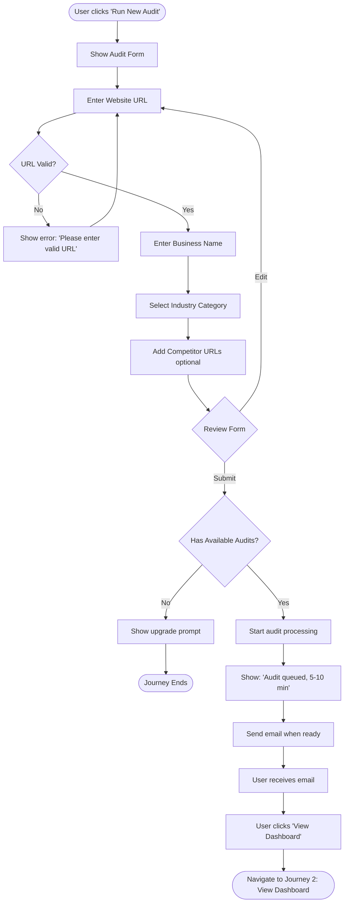
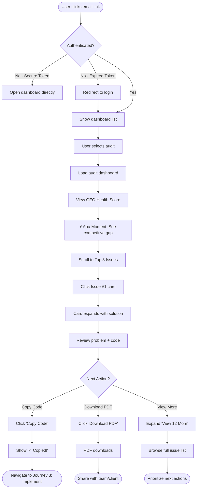
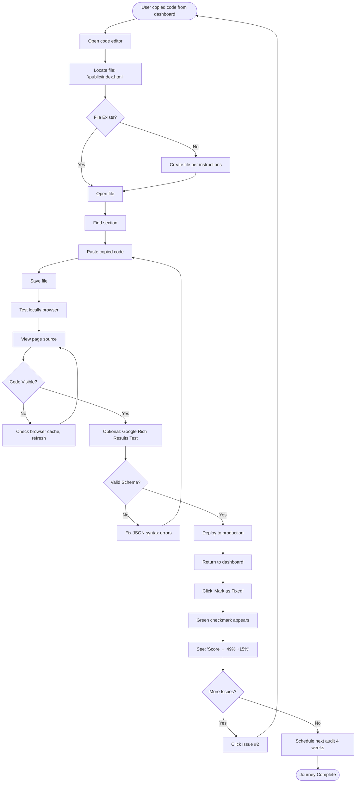
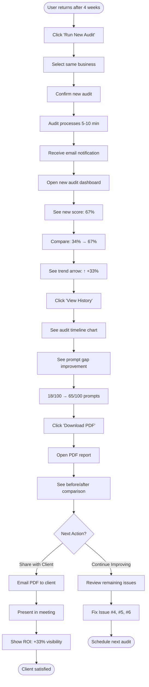

# UX Design Specification - AISEO

**Author:** Maxlemoinegavoille
**Date:** 2026-01-19

---

## Executive Summary

### Project Vision

AISEO is a first-mover GEO (Generative Engine Optimization) audit platform addressing a critical emerging problem: businesses are becoming invisible in the AI search era. While companies rank well on Google, they don't appear in ChatGPT, Claude, or Perplexity recommendations - effectively becoming invisible to a growing segment of search traffic.

The platform systematically tests 100 AI prompts across 4 engines (ChatGPT, Claude, Perplexity, DeepSeek), identifies visibility gaps, and provides actionable, copy-paste ready recommendations to optimize for AI discovery.

**Key Differentiators from UX Perspective:**
- First comprehensive GEO audit tool (category creation opportunity)
- Dual-level design: Non-technical visual dashboard + technical implementation guide
- Immediate actionability: Copy-paste code snippets vs vague advice
- Competitive comparison psychology: Visual gap analysis creates urgency
- Premium polish from day 1: Agency-grade UI quality as credibility signal

**Go-to-Market Model:** B2B2B distribution via marketing agencies (primary) + direct B2B (secondary)

### Target Users

**Primary Personas:**

**1. Sophie - Agency Director (Primary Distribution Channel)**
- 38 years old, runs 12-person marketing agency
- Tech comfort: Medium (understands SEO concepts, delegates technical implementation)
- **Context of use:** Presenting reports to clients, selling GEO services
- **Pain point:** Client asks "Why doesn't ChatGPT recommend my business?" - has no answer
- **Success moment:** Shows dashboard, client says "This is exactly what I need!" and signs €3,500 package
- **UX needs:** Professional presentation-ready UI, clear non-technical explanations, competitive comparison charts

**2. Marc - Business Owner (Secondary Direct User)**
- 52 years old, owns 3 organic restaurants in Paris
- Tech comfort: Low (can use basic tools, needs simple interfaces)
- **Context of use:** Understanding why he's invisible despite good Google ranking
- **Pain point:** Invested €50K in SEO, ranks #3 Google, but zero AI mentions
- **Success moment:** Sees "You appear in 25/100 prompts (25%), competitor in 63/100 (63%)" - understands immediately
- **UX needs:** Visual dashboard with color-coded scores, plain language, before/after tracking

**3. Julien - Freelance SEO Consultant (Power User)**
- 29 years old, independent SEO consultant
- Tech comfort: High (technical SEO expert)
- **Context of use:** Pitching to prospects, differentiating from low-cost competition
- **Pain point:** Offshore agencies crush prices, needs unique value proposition
- **Success moment:** Positions as "SEO + GEO expert", charges 50% premium
- **UX needs:** Shareable reports, competitive data for sales pitches, LinkedIn-worthy visualizations

**4. Emma - Full-Stack Developer (Technical Implementer)**
- 26 years old, freelance full-stack developer
- Tech comfort: Very high (technical implementer)
- **Context of use:** Implementing GEO recommendations for clients
- **Pain point:** Receives vague requests like "make us rank in ChatGPT"
- **Success moment:** Receives AISEO report with exact code snippets, implements in 2 hours instead of 2 weeks research
- **UX needs:** Technical precision, copy-paste ready code, exact file locations, prioritized tasks

**Device Context:**
- Primary: Desktop/laptop (dashboard work, report presentation)
- Secondary: Tablet (client presentations on-the-go)
- Minimal mobile usage (complex dashboards don't translate well to mobile)

### Key Design Challenges

**Challenge 1: Dual-Audience Interface Design**

**Problem:** Same report must serve both non-technical business owners (Sophie, Marc) and technical implementers (Emma).

**UX Strategy:**
- Implement **two-view architecture**: Executive Summary (visual, plain-language, "why it matters") + Technical Details (code snippets, file locations, implementation steps)
- Use progressive disclosure: Start with high-level dashboard, allow drill-down to technical depth
- Clear visual separation: Executive section uses infographics/charts, Technical section uses code blocks/terminal-style
- **Reference inspiration:** Dreelio's clean dual-panel layouts

**Challenge 2: Making "Invisible" Tangible**

**Problem:** AI invisibility is abstract - users can't "see" the problem like they can see Google rankings.

**UX Strategy:**
- **Prompt Gap Analysis visualization**: Show "18/100 prompts mention you" vs "72/100 for competitor" - makes invisible visible
- Color psychology: Red (invisible/bad) → Orange (partial) → Green (visible/good)
- Competitive comparison charts: Side-by-side bars create emotional impact
- Before/after tracking: Show improvement over time with clear trend lines
- **Reference inspiration:** Almond's metric cards with percentage deltas

**Challenge 3: Premium Polish Requirement**

**Problem:** Agencies won't adopt "ugly" tools - UI quality = credibility signal in their eyes.

**UX Strategy:**
- Adopt Dreelio/Almond/Base44 aesthetic: Soft backgrounds, generous spacing, refined typography
- No compromises on visual polish: Professional from day 1 (not "MVP ugly then improve")
- Micro-interactions and smooth transitions: Spring animations, hover states
- Attention to detail: Consistent spacing (8px grid), proper visual hierarchy, thoughtful color usage
- **Reference inspiration:** Direct copy-paste of Dreelio's dashboard card style, Almond's color palette restraint

### Design Opportunities

**Opportunity 1: "Aha Moment" Dashboard**

**Concept:** User opens dashboard → understands problem in < 10 seconds → feels urgency to act

**Execution:**
- Hero metric: GEO Health Score (0-100%) with color ring (red/orange/green)
- Immediate comparison: "You: 34% | Competitor Average: 68%" - gap is shocking
- Top 3 critical issues displayed as cards with red flags
- Visual prompt gap: "You appear in 18/100 AI searches" with empty/filled circles visualization
- **Inspiration:** Dreelio's dashboard with big numbers + percentage deltas

**Opportunity 2: Copy-Paste Actionability**

**Concept:** Differentiate from competitors by providing immediately usable solutions, not generic advice.

**Execution:**
- Code snippets with syntax highlighting and one-click copy button
- Exact file locations: "Add to `/pages/about.tsx` line 42"
- Before/after code diffs: Show what to change
- Pre-written FAQ content: 10 questions + answers ready to paste
- Alt text suggestions: List of images with suggested descriptions
- **Inspiration:** GitHub code blocks, VS Code diff view aesthetic

**Opportunity 3: Competitive Comparison Psychology**

**Concept:** Leverage competitive jealousy/FOMO to create urgency

**Execution:**

- Competitor naming (if provided): "Restaurant Le Potager appears 3x more than you"
- Side-by-side bar charts: Visual gap creates emotional response
- Category breakdown: "You're invisible in 'best organic restaurants' but visible in 'vegan options'"
- Trend comparison: "Competitor improved 15% last month, you stayed flat"
- **Inspiration:** Sports stats comparisons, stock market charts (red/green psychology)

**Opportunity 4: Multi-Language Elegance**

**Concept:** Seamless English/French switching without page reload

**Execution:**
- Language toggle in header (flag icons or EN/FR text)
- Instant UI update (no page refresh)
- PDF reports generated in user's preferred language
- Future-proof for expansion: German, Spanish, Italian
- **Inspiration:** Stripe's language switcher, Linear's i18n implementation

---

## Core User Experience

### Defining Experience

**Primary User Action - The Critical Flow:**

The most critical interaction in AISEO is the **"Insight to Action" flow** that happens in the first 2-3 minutes after opening an audit dashboard:

1. **Open Dashboard** (0-10 seconds): User sees GEO Health Score, competitive gap, and immediate problem understanding
2. **Understand Problem** (10-60 seconds): User drills into top 3 critical issues with visual explanations
3. **See Actions** (60-180 seconds): User identifies first actionable step with copy-paste ready code

This flow must be **absolutely perfect** because:
- Sophie (agency director) presents this to clients - must be instantly convincing
- Marc (business owner) needs to understand without technical help - must be crystal clear
- Julien (freelancer) uses this to differentiate and sell - must create urgency
- Emma (developer) needs to know what to implement - must be immediately actionable

**Secondary Critical Action:**

Running a new audit must be **effortless**: Enter URL → Click "Run Audit" → Processing notification → Email when ready (5-10 minutes) → Return to view results

**Tertiary Actions:**

- Downloading PDF report (1-click from dashboard)
- Comparing with competitors (automatic side-by-side visualization)
- Tracking improvement over time (before/after comparison)
- Switching language EN/FR (instant UI update)

### Platform Strategy

**Primary Platform: Desktop/Laptop Web Application**

- **Rationale:** Complex dashboards with data visualizations, charts, code snippets require screen real estate
- **User Context:** Sophie presents on laptop to clients, Marc reviews at office desk, Emma codes on desktop
- **Tech Stack:** Next.js web app (no native mobile apps needed)

**Secondary Platform: Tablet (iPad/Android)**

- **Use Case:** Sophie presenting audit reports to clients on-the-go
- **Priority:** Dashboard must be usable on tablet (readable metrics, tappable controls)
- **Compromise:** Code snippets may require horizontal scroll - acceptable for tablet use case

**Landing Page Only: Mobile Responsive**

- **Rationale:** Marketing/acquisition happens on mobile (Google ads, social media)
- **Scope:** Landing page, pricing page, sign-up flow must be mobile-optimized
- **Compromise:** Once logged in, user directed to "Use desktop for best experience" message if on mobile

**Platform Priorities:**
1. Desktop/Laptop (1920x1080 and 1440x900 primary viewports)
2. Tablet landscape (1024x768 and iPad Pro)
3. Mobile (landing page only, 375x667 iPhone SE baseline)

### Effortless Interactions

These interactions must require **zero cognitive load** - completely natural and seamless:

**1. Launching New Audit (Simplest Possible)**
- Single input field: "Enter website URL"
- Smart URL validation: Auto-adds https://, detects format errors
- One button: "Run GEO Audit"
- Clear expectation setting: "Processing takes 5-10 minutes. We'll email you when ready."
- Background processing: User can close browser, audit continues
- **Inspiration:** Google Search simplicity (1 input, 1 button)

**2. Downloading PDF Report (1-Click)**
- Prominent "Download Report" button on dashboard
- Instant download (pre-generated PDF, no wait time)
- Filename auto-formatted: `AISEO_Report_{BusinessName}_{Date}.pdf`
- **Inspiration:** Stripe receipt downloads

**3. Copying Code Snippets (Hover + Click)**
- Syntax-highlighted code blocks
- Hover reveals "Copy" button with clipboard icon
- Click copies to clipboard with visual confirmation ("Copied!")
- Before/after diff view for modifications
- **Inspiration:** GitHub code blocks, Vercel documentation

**4. Comparing with Competitors (Automatic)**
- User enters competitor URL during audit setup (optional, up to 5 URLs)
- System automatically fetches competitor GEO scores
- Side-by-side bar chart visualization appears in dashboard
- Color-coded: User (blue), Competitors (gray), Best performer (green)
- **Inspiration:** Sports stats comparisons, stock charts

**5. Switching Language EN/FR (Instant)**
- Toggle in header: Flag icons or "EN | FR" text
- Click switches entire UI instantly (no page reload)
- Preference saved to user account
- PDF reports generated in user's preferred language
- **Inspiration:** Stripe language switcher, Linear i18n

**6. Tracking Improvement (Automatic Timeline)**
- Audit history shown as timeline on dashboard
- Before/after score comparison with trend arrows (↑ +15% green, ↓ -5% red)
- Click any past audit to see full historical dashboard
- **Inspiration:** GitHub contribution graph, fitness app progress tracking

### Critical Success Moments

**Moment 1: The "Aha Moment" (0-10 seconds after opening dashboard)**

**Context:** User has just received email "Your GEO Audit is Ready" and clicks to view dashboard.

**What Happens:**
- Dashboard loads with hero metric: **GEO Health Score 34%** in red circular progress ring
- Immediate comparison below: **"You: 34% | Competitor Average: 68%"** with gap visualization
- Visual prompt gap: **"You appear in 18/100 AI searches"** with 18 filled circles, 82 empty circles

**Emotional Response:** "Oh merde, je suis vraiment invisible!" (shock, urgency, understanding)

**Why Critical:**
- If this moment fails (confusing, unclear, slow), user bounces
- Sophie needs this to be presentation-ready - client must "get it" instantly
- Marc needs to understand problem without technical explanation

**Design Requirements:**
- Load in < 2 seconds (no spinner on empty state)
- Color psychology: Red = bad, Orange = medium, Green = good
- Big numbers with visual comparison (not just text)
- **Reference:** Dreelio dashboard cards with percentage deltas

---

**Moment 2: The "Actionable Moment" (1-3 minutes after Aha Moment)**

**Context:** User understands the problem, now scrolling to see "What do I do about it?"

**What Happens:**
- Top 3 critical issues displayed as cards with red flag icons
- Each card shows:
  - **Issue title:** "Missing FAQ Schema - AI can't understand your content"
  - **Impact:** "Fix this to improve visibility in 40/100 prompts"
  - **Effort:** "Easy - 30 minutes implementation"
- Click card expands to show:
  - Plain-language explanation (Grade 8 reading level)
  - Exact code snippet with syntax highlighting
  - File location: "Add to `/pages/about.tsx` line 42"
  - Copy button with clipboard icon

**Emotional Response:** "Je peux fix ça maintenant!" (empowerment, confidence)

**Why Critical:**
- If recommendations are vague ("improve your SEO"), user is stuck
- Emma needs exact instructions to implement without 2 weeks of research
- Sophie needs to explain to client's developer what to do

**Design Requirements:**
- Prioritization crystal clear (🔴 Critical, 🟠 Important, 🟢 Nice-to-have)
- Code ready to copy-paste (not pseudo-code)
- Visual separation: Executive view (why) + Technical view (how)
- **Reference:** GitHub code blocks, VS Code diff view

---

**Moment 3: The "Proof Moment" (3 months after implementing recommendations)**

**Context:** User has implemented top 3 recommendations, waiting to see if it actually works.

**What Happens:**
- User re-runs audit (same URL)
- Dashboard shows before/after comparison:
  - **Old score:** 34% (red)
  - **New score:** 67% (green)
  - **Change:** +33% with upward trend arrow
- Prompt gap shows: **"You now appear in 54/100 AI searches"** (+36 prompts)
- Timeline chart shows progression over 3 months

**Emotional Response:** "Ça marche vraiment! C'est pas du bullshit!" (validation, ROI proof, advocacy)

**Why Critical:**
- If improvements aren't measurable, user churns
- Marc needs to justify €299 audit cost to himself
- Sophie needs proof to sell more GEO packages to other clients
- Julien needs case study testimonial for LinkedIn

**Design Requirements:**
- Before/after comparison prominent and visual
- Show absolute change (+33%) and relative improvement (+36 prompts)
- Historical timeline to track continuous improvement
- Export/screenshot friendly (for presentations and social sharing)
- **Reference:** Fitness apps progress tracking, stock market gain/loss visualization

### Experience Principles

These principles guide all UX decisions for AISEO:

**Principle 1: Instant Comprehension Over Explanation**
- User should understand the problem in < 10 seconds without reading instructions
- Visual > Text. Charts > Tables. Colors > Words.
- If it needs explanation, the UX failed

**Principle 2: Actionable Over Diagnostic**
- Every problem shown must have immediate, copy-paste ready solution
- No vague advice ("improve your content") - only specific instructions
- Developer can implement without Googling anything

**Principle 3: Evidence Over Claims**
- Show competitive gap, not just score
- Before/after comparison, not just current state
- Prompt-by-prompt breakdown, not just aggregate number

**Principle 4: Premium Polish, Not MVP Ugly**
- Agencies won't adopt tools that look unprofessional
- UI quality = credibility signal for B2B users
- Dreelio/Almond aesthetic baseline, not "we'll improve UI later"

**Principle 5: Desktop-First, Mobile-Friendly Landing**
- Complex dashboards require screen space - no compromises
- Mobile users directed to desktop for full experience
- Only landing/marketing pages need mobile perfection

**Principle 6: Quality Over Speed (Audits)**
- 5-10 minute audit = thorough, valuable analysis
- Too fast = perceived as superficial
- Timeout is anti-hang protection, not performance requirement

---

## Desired Emotional Response

### Primary Emotional Goals

**Core Emotional Approach: Professional Clarity + Actionable Confidence**

AISEO's emotional design philosophy is **pragmatic and business-mature**, not sensational or dramatic. The product creates a professional experience focused on clarity and actionability.

**Primary Emotion:** Professional Clarity + Opportunity Recognition
- "Ah ok, voici le problème, voici les 3 actions, c'est clair, je peux agir"
- NOT: "Oh mon dieu c'est terrible!" (dramatization)
- BUT: "GEO est important maintenant, vous pouvez être dans la partie si vous faites ça, ça, ça"

**Key Emotional Components:**
1. **Clarity:** Problem presented clearly with evidence (scores, comparisons, data)
2. **Opportunity:** GEO is becoming critical, you can be visible, here's how
3. **Confidence:** You have exact actions to take - not overwhelmed, in control
4. **Validation:** After implementation, confirmation that it works (ROI proof)

**Differentiation from Competitors:**
Traditional SEO tools (Ahrefs, SEMrush) create "analysis paralysis" - lots of data, vague recommendations. AISEO creates **"Actionable Confidence"** - clear problem, specific solutions, immediate implementability.

### Emotional Journey Mapping

**Stage 1: Landing Page (Discovery)**

**Desired Emotion:** Awareness + Professional Opportunity
- **Message:** "GEO is becoming critical. You can be visible. Here's how."
- **NOT:** FOMO panic ("You're in danger! Act now!")
- **BUT:** Professional opportunity to seize ("Be ahead of the curve")
- **Design Tone:** Informative, confident, forward-looking

**Stage 2: Dashboard (Analysis)**

**Desired Emotion:** Professional Clarity + Control
- **Message:** "Here are your gaps (clear evidence), here are the solutions (precise actions)"
- **NOT:** Overwhelm with too much data
- **BUT:** Clear view of problem + clear path forward
- **Design Tone:** Clean, organized, hierarchical (most important first)

**Stage 3: Recommendations (Action Planning)**

**Desired Emotion:** Actionable Confidence
- **Message:** "To fix: do this, this, this (copy-paste code, clear steps)"
- **NOT:** Confusion about what to do next
- **BUT:** Confidence "I can implement this right now"
- **Design Tone:** Practical, technical precision, supportive

**Stage 4: Implementation (Developer Experience)**

**Desired Emotion:** Accomplishment + Efficiency
- **Message:** "Implemented in 2 hours instead of 2 weeks of research"
- **NOT:** Frustration with vague instructions
- **BUT:** Satisfaction with clear, copy-paste ready solutions
- **Design Tone:** Developer-friendly, GitHub-style code blocks

**Stage 5: Proof (3 Months After)**

**Desired Emotion:** Validated Confidence + Advocacy
- **Message:** "It works, score improved, I can recommend this"
- **NOT:** Excessive surprise (implies initial skepticism)
- **BUT:** Professional confirmation of ROI
- **Design Tone:** Evidence-based, before/after comparison, shareable proof

### Micro-Emotions (Critical Pairs)

**Trust > Skepticism**

**Why Critical:** Agencies must trust tool to present to clients; business owners invest €299 based on credibility

**Design Implications:**
- Evidence-based visualizations (competitive comparisons, not just self-assessment)
- Transparent methodology (show prompt-by-prompt breakdown)
- Professional polish (Dreelio-level UI = credibility signal)
- No marketing fluff - direct, data-driven communication

---

**Confidence > Confusion**

**Why Critical:** Marc (non-technical business owner) must understand without technical help

**Design Implications:**
- Visual > Text (charts, color-coded scores, progress rings)
- Plain language explanations (Grade 8 reading level)
- Progressive disclosure (simple view first, technical details on demand)
- Instant comprehension (understand problem in < 10 seconds)

---

**Control > Overwhelm**

**Why Critical:** Users must feel in control, not drowning in data and recommendations

**Design Implications:**
- Top 3 critical issues prominently displayed
- Remaining recommendations collapsible ("View all 12 recommendations")
- Clear prioritization (🔴 Critical, 🟠 Important, 🟢 Nice-to-have)
- Effort estimates ("Easy - 30 minutes" vs "Complex - 4 hours")

---

**Accomplishment > Frustration**

**Why Critical:** Emma (developer) must feel "this is doable" not "this is impossible"

**Design Implications:**
- Copy-paste ready code snippets with syntax highlighting
- Exact file locations ("/pages/about.tsx line 42")
- Before/after code diffs showing exactly what changes
- One-click copy buttons with visual confirmation

### Design Implications for Emotional Goals

**To Create Professional Clarity:**

1. **Hero Metrics with Context**
   - Score displayed: 34% (not just number)
   - Comparison: "You: 34% | Competitor Average: 68%"
   - Visual gap representation (bars, rings, charts)

2. **Simple Color Psychology**
   - Red = Problem/Low score
   - Orange = Medium/Needs attention
   - Green = Good/High score
   - NO complex gradients or 10 shades

3. **Clear Visual Hierarchy**
   - Score → Problems → Solutions (top to bottom)
   - Most critical information largest/top
   - Supporting details smaller/collapsible

**To Create Actionable Confidence:**

1. **Code Snippets**
   - Syntax highlighting (language-appropriate)
   - Copy button on hover with clipboard icon
   - "Copied!" confirmation animation

2. **Expectation Setting**
   - Effort estimates on each recommendation
   - Impact quantification ("Fix this → improve in 40/100 prompts")
   - Priority clear (Critical items shown first)

3. **Before/After Previews**
   - Show current code vs recommended code
   - Visual diff highlighting changes
   - Context of where to add code

**To Avoid Overwhelm:**

1. **Progressive Disclosure**
   - Top 3 critical issues always visible
   - "View all 12 recommendations" expandable section
   - Technical details behind "Show technical explanation" toggle

2. **Focused Views**
   - Executive Summary view (for Sophie/Marc)
   - Technical Details view (for Emma)
   - Toggle between views, don't show both simultaneously

3. **Guided Prioritization**
   - "Start here" indicator on first critical issue
   - Numbered steps if sequential order matters
   - "Optional" label on nice-to-have items

**To Create Trust:**

1. **External Evidence**
   - Competitive comparison (not just self-assessment)
   - Prompt-by-prompt breakdown (transparency)
   - Show which specific prompts mentioned/didn't mention business

2. **Methodology Transparency**
   - "How we calculate GEO Score" available (not hidden)
   - List of 100 prompts testable (user can see what's tested)
   - AI engines used clearly stated (ChatGPT, Claude, Perplexity, DeepSeek)

3. **Professional Credibility Signals**
   - Premium UI polish from day 1
   - Consistent branding and typography
   - Error-free experience (99%+ audit success rate)

### Emotional Design Principles

**Principle 1: Clarity Trumps Everything**
- If user doesn't understand in 10 seconds, design failed
- Visual > Text > Explanation
- Simplify until it can't be simpler, then simplify more

**Principle 2: Show Evidence, Not Claims**
- Don't say "You have problems" - show competitive gap
- Don't claim "This works" - show before/after improvement
- Data > Marketing copy

**Principle 3: Actionable Over Impressive**
- Don't show 50 metrics to impress - show 3 critical actions
- Don't use technical jargon to sound smart - use plain language
- Users care about "what do I do?" not "how smart is this tool?"

**Principle 4: Professional, Not Sensational**
- Tone: Business consultant, not used car salesman
- Language: Direct and clear, not hyped and urgent
- Visuals: Clean and organized, not flashy and overwhelming

**Principle 5: Empower, Don't Overwhelm**
- Give control through clear options, not paralysis through too many choices
- Prioritize ruthlessly - most important first, rest hidden
- Progressive disclosure - reveal complexity only when user asks

**Principle 6: Trust Through Transparency**
- Show methodology, don't hide it
- Admit limitations (e.g., "Competitor data unavailable")
- No marketing BS - users are professionals, treat them as such

---

## UX Pattern Analysis & Inspiration

### Inspiring Products Analysis

**1. Dreelio (https://dreelio.framer.website/)**

**What they do well:**
- **Premium Visual Polish:** Soft gradient backgrounds (#F8F9FB → #FFFFFF), rounded corners (20-24px), generous white space creates immediate "this is professional" impression
- **Progressive Disclosure:** Hero section with single clear value proposition, complexity revealed through scroll
- **Visual Hierarchy:** Large typography for headlines (48-64px), clear size contrast guides eye naturally
- **Micro-interactions:** Subtle hover states, smooth transitions (300-400ms) feel polished without being distracting
- **Evidence-Based Trust:** Screenshots, metrics, social proof positioned strategically

**Core UX Principle:** Visual sophistication signals credibility before user reads a single word.

**2. Almond (https://almond.framer.website/)**

**What they do well:**
- **Scannable Content:** Short paragraphs (2-3 lines max), bullet points, clear section breaks
- **Action-Oriented Design:** CTAs use action verbs ("Start building", "See how it works"), not passive labels
- **Consistent Spacing System:** 64px, 96px, 120px spacing creates rhythm and breathability
- **Color Psychology:** Muted color palette (desaturated blues/greens) feels calm and professional
- **Component Modularity:** Repeating card patterns create familiarity and reduce cognitive load

**Core UX Principle:** Simplicity and clarity trump cleverness every time.

**3. Base44 (base44.com)**

**What they do well:**
- **Typography-Driven Design:** Font choices (likely Inter or similar) create modern, readable interface
- **Grid-Based Layouts:** Strong alignment and consistent column structures feel organized
- **Whitespace as Design Element:** Not afraid of empty space - lets content breathe
- **Subtle Animations:** Page transitions and element reveals feel natural, not "showy"
- **Professional Restraint:** No unnecessary decorations, every element serves a purpose

**Core UX Principle:** Restraint and precision create professionalism.

### Transferable UX Patterns

**Navigation Patterns:**

**Pattern 1: Sticky Header with Context**
- **From:** All three sites use persistent navigation
- **Adapt for AISEO:** Dashboard header shows: Logo + Current Project Name + Audit Status + CTA ("Run New Audit")
- **Why it works:** User never loses context of where they are or what action to take next

**Pattern 2: Sidebar Navigation for Complex Apps**
- **From:** Base44's structured navigation
- **Adapt for AISEO:** Left sidebar for dashboard sections (Overview, Recommendations, Competitors, History)
- **Why it works:** Desktop-first design benefits from persistent navigation vs hamburger menus

**Interaction Patterns:**

**Pattern 3: Card-Based Information Architecture**
- **From:** Almond's card system
- **Adapt for AISEO:** Top 3 critical issues as cards with: Icon + Title + Impact Score + CTA ("Fix This")
- **Why it works:** Cards create visual separation, make content scannable, work across breakpoints

**Pattern 4: Progressive Disclosure with "Show More"**
- **From:** Dreelio's content layering
- **Adapt for AISEO:** Show 3 critical issues prominently, "View 12 more recommendations" expands full list
- **Why it works:** Prevents overwhelm (Step 4 emotional goal: Control > Overwhelm)

**Pattern 5: One-Click Actions with Immediate Feedback**
- **From:** All three sites have responsive CTAs
- **Adapt for AISEO:** "Copy Code" button → shows "✓ Copied!" for 2 seconds
- **Why it works:** Confirmation reduces anxiety, feels polished

**Visual Patterns:**

**Pattern 6: Soft Gradient Backgrounds**
- **From:** Dreelio's subtle gradients (#F8F9FB → #FFFFFF)
- **Adapt for AISEO:** Dashboard background uses gentle gradient, not flat white
- **Why it works:** Adds depth without distraction, feels premium

**Pattern 7: Rounded Corners (20-24px)**
- **From:** All three sites avoid sharp edges
- **Adapt for AISEO:** Cards, buttons, modals use 20px border radius
- **Why it works:** Feels modern and approachable (hard edges feel dated)

**Pattern 8: Generous Spacing System**
- **From:** Base44's breathing room
- **Adapt for AISEO:** 64px section spacing, 32px card padding, 16px internal spacing
- **Why it works:** Creates visual hierarchy, reduces cognitive load

**Pattern 9: Typography Scale**
- **From:** Dreelio's clear size contrast
- **Adapt for AISEO:** H1: 48px, H2: 32px, H3: 24px, Body: 16px, Small: 14px
- **Why it works:** Clear hierarchy guides eye without user thinking about it

**Pattern 10: Status Indicators with Color + Icon**
- **From:** Common pattern across all three
- **Adapt for AISEO:** GEO Health Score uses: Color ring (red/yellow/green) + Percentage + Icon + Label
- **Why it works:** Redundant encoding (color + text + icon) ensures accessibility and instant understanding

### Anti-Patterns to Avoid

**Anti-Pattern 1: Over-Animation**
- **What to avoid:** Excessive motion, spinning loaders, bouncing elements
- **Why it's bad:** Feels unprofessional for B2B, distracts from content
- **AISEO approach:** Subtle transitions only (300ms fade-ins), no "playful" animations

**Anti-Pattern 2: Dashboard Overload**
- **What to avoid:** Showing all 50 metrics at once in dashboard
- **Why it's bad:** Creates overwhelm (conflicts with Step 4 emotional goal)
- **AISEO approach:** Hero metric (GEO Score) + Top 3 issues + "View More" for rest

**Anti-Pattern 3: Hidden Navigation**
- **What to avoid:** Hamburger menus on desktop, mystery meat navigation
- **Why it's bad:** Desktop users expect visible navigation (platform strategy from Step 3)
- **AISEO approach:** Persistent sidebar navigation on desktop (1440px+)

**Anti-Pattern 4: Vague CTAs**
- **What to avoid:** Buttons labeled "Learn More", "Click Here", "Submit"
- **Why it's bad:** Doesn't communicate value or action outcome
- **AISEO approach:** Action-specific CTAs ("Run GEO Audit", "Download PDF Report", "Copy Code")

**Anti-Pattern 5: Technical Jargon in UI**
- **What to avoid:** Labels like "API Response Time", "Schema Markup Coverage"
- **Why it's bad:** Marc (non-tech user) won't understand
- **AISEO approach:** Plain language ("Page Load Speed", "Search Engine Info") with tooltips for tech details

**Anti-Pattern 6: Flat Design Taken Too Far**
- **What to avoid:** No shadows, no depth, everything on same plane
- **Why it's bad:** Feels sterile, makes buttons/cards blend together
- **AISEO approach:** Subtle shadows (0px 2px 8px rgba(0,0,0,0.08)) create depth without being heavy

### Design Inspiration Strategy

**What to Adopt Directly:**

1. **Dreelio's Gradient Backgrounds** → AISEO dashboard uses soft gradients for premium feel
2. **Almond's Card System** → AISEO recommendations use card-based architecture
3. **Base44's Typography Precision** → AISEO adopts similar font scale and spacing rhythm
4. **All Three: 20-24px Border Radius** → AISEO uses 20px standard for modern aesthetic
5. **All Three: 64px+ Section Spacing** → AISEO adopts generous whitespace system

**What to Adapt for AISEO Context:**

1. **Sidebar Navigation (from Base44)** → Adapt for dashboard-specific sections (not general website nav)
2. **Progressive Disclosure (from Dreelio)** → Adapt for dual-audience view (Executive vs Technical toggle)
3. **Status Indicators** → Adapt for GEO-specific metrics (Health Score, Prompt Gap Analysis)
4. **Action-Oriented CTAs (from Almond)** → Adapt for audit-specific actions ("Fix Schema", "Improve Content")

**What to Avoid:**

1. **Consumer App Playfulness** → AISEO targets B2B agencies, needs professional restraint
2. **Mobile-First Layouts** → AISEO is desktop-first (per Step 3 platform strategy)
3. **Marketing-Heavy Language** → AISEO focuses on clarity and evidence (per Step 4 emotional goals)
4. **Overly Minimalist** → Can't hide complexity - need to show data, just organize it well

**Implementation Philosophy:**

"Copy the aesthetic system (spacing, typography, colors, shapes), but adapt the content architecture for AISEO's dual-audience needs and data-heavy dashboard requirements."

---

## Design System Foundation

### Design System Choice

**Selected System:** Tailwind CSS + Shadcn/ui (or Magic UI for specialized components)

### Rationale for Selection

AISEO requires a design system that balances **premium visual polish** (Dreelio/Almond aesthetic) with **rapid MVP development** (solo founder, 12-18 month first-mover window).

**Why Tailwind CSS + Shadcn/ui:**

1. **Stack Alignment:** Official project stack from project-context.md mandates Tailwind CSS as the sole UI framework (no mixing multiple frameworks)

2. **Maximum Aesthetic Control:** Utility-first approach allows exact replication of inspiration patterns (soft gradients, 20px borders, 64-120px spacing) without fighting framework opinions

3. **Component Ownership:** Shadcn/ui and Magic UI both use copy-paste model - components live in project codebase (`components/ui/`), not hidden in node_modules. Full customization freedom.

4. **Selective Component Installation:** Download ONLY needed components (Button, Card, Dialog, etc.), no bloated library imports

5. **Next.js Optimization:** Tailwind is de facto standard for Next.js 15.x apps (excellent DX, small bundle with tree-shaking, zero runtime)

6. **Premium Polish Achievable:** Can achieve Dreelio-level aesthetic without months of custom design system work

**Magic UI vs Shadcn/ui:**
- **Shadcn/ui:** Core UI primitives (Button, Card, Dialog, Dropdown, Table)
- **Magic UI:** Specialized components (advanced animations, data visualizations, interactive elements)
- **Approach:** Use Shadcn for base components, Magic UI for specialized needs

**Tradeoffs Accepted:**
- More manual styling vs "magic" component library
- Need to define design tokens upfront (colors, spacing, typography)
- Less "out of box" look (good - we want unique aesthetic)

### Implementation Approach

**Phase 1: Foundation Setup**

```bash
# Install Tailwind CSS
npm install -D tailwindcss postcss autoprefixer
npx tailwindcss init -p

# Install Shadcn/ui
npx shadcn-ui@latest init

# Install supporting packages
npm install clsx tailwind-merge class-variance-authority
```

**Phase 2: Design Token Definition**

Define in `tailwind.config.js`:

```javascript
module.exports = {
  theme: {
    extend: {
      colors: {
        // Define AISEO brand colors
        primary: {
          50: '#eff6ff',
          100: '#dbeafe',
          // ... full scale
          600: '#3b82f6', // Main brand color
          700: '#2563eb',
        },
        success: {
          500: '#10b981', // Green for high scores
          600: '#059669',
        },
        warning: {
          500: '#f59e0b', // Yellow for medium scores
          600: '#d97706',
        },
        error: {
          500: '#ef4444', // Red for low scores/critical issues
          600: '#dc2626',
        },
        neutral: {
          50: '#f9fafb',
          100: '#f3f4f6',
          // ... gray scale for text hierarchy
          900: '#111827',
        }
      },
      spacing: {
        // Generous spacing system (Dreelio-inspired)
        // 16 = 64px, 20 = 80px, 24 = 96px, 30 = 120px
      },
      borderRadius: {
        DEFAULT: '20px', // Standard AISEO radius
        'xl': '12px', // Buttons
        '2xl': '24px', // Large cards
      },
      boxShadow: {
        'subtle': '0px 2px 8px rgba(0, 0, 0, 0.08)', // Card shadows
        'elevated': '0px 4px 16px rgba(0, 0, 0, 0.12)', // Modal shadows
      },
      typography: {
        // H1: 48px, H2: 32px, H3: 24px, Body: 16px, Small: 14px
      }
    }
  }
}
```

**Phase 3: Component Strategy**

**From Shadcn/ui - Core Primitives:**

```bash
# Essential components for AISEO
npx shadcn-ui@latest add button
npx shadcn-ui@latest add card
npx shadcn-ui@latest add dialog
npx shadcn-ui@latest add dropdown-menu
npx shadcn-ui@latest add tabs
npx shadcn-ui@latest add table
npx shadcn-ui@latest add tooltip
npx shadcn-ui@latest add badge
npx shadcn-ui@latest add input
npx shadcn-ui@latest add select
```

**From Magic UI - Specialized (if needed):**
- Advanced animations for dashboard transitions
- Interactive data visualization components
- Copy only specific components needed

**Build Custom Components:**
1. **GEO Score Ring** (circular progress indicator with color gradient)
2. **Prompt Gap Analysis Chart** (bar chart visualization with competitor comparison)
3. **Code Block with Copy Button** (syntax highlighting + clipboard API)
4. **Competitor Comparison Cards** (side-by-side layout with visual gap indicators)
5. **Audit Status Timeline** (progress visualization with stages)

**Data Visualization Library:**
- Use **Recharts** (React charts) with Tailwind color tokens
- Custom styling to match AISEO aesthetic

**Phase 4: Pattern Library Documentation**

Create reusable patterns in Storybook (or similar):
- Card layouts (stat card, issue card, recommendation card)
- Dashboard layouts (header, sidebar, main content grid)
- Form patterns (input styles, validation states, error messages)
- Typography hierarchy (heading styles, body text, captions, code)
- Button variants (primary, secondary, ghost, danger)
- Status indicators (success, warning, error with icons)

### Customization Strategy

**Visual Aesthetic Alignment (Dreelio/Almond Patterns):**

**1. Backgrounds:**
- Soft gradients: `bg-gradient-to-br from-neutral-50 to-white`
- Card backgrounds: `bg-white` with `shadow-subtle`
- Dashboard background: `bg-neutral-50`

**2. Spacing System:**
- Section spacing: `space-y-16` (64px between major sections)
- Card padding: `p-8` (32px internal padding)
- Element spacing: `space-y-4` (16px between elements)
- Grid gaps: `gap-6` (24px between cards)

**3. Typography:**
- Font: Inter or similar (`font-sans` in Tailwind)
- Scale:
  - H1: `text-5xl font-semibold` (48px)
  - H2: `text-3xl font-semibold` (32px)
  - H3: `text-xl font-medium` (24px)
  - Body: `text-base` (16px)
  - Small: `text-sm` (14px)
  - Code: `text-sm font-mono` (14px monospace)
- Weights: Regular (400), Medium (500), Semibold (600)
- Line height: Relaxed (`leading-relaxed` for body text)

**4. Borders & Shadows:**
- Standard card radius: `rounded-[20px]` (20px)
- Button radius: `rounded-xl` (12px)
- Input radius: `rounded-lg` (8px)
- Card shadows: `shadow-subtle` for cards
- Modal shadows: `shadow-elevated` for dialogs
- Hover elevation: `hover:shadow-elevated transition-shadow`

**5. Color Usage:**
- **Primary Blue:** CTAs, links, brand elements
- **Success Green:** High GEO scores (70%+), completed actions
- **Warning Yellow:** Medium scores (40-69%), attention needed
- **Error Red:** Critical issues, low scores (<40%), failures
- **Neutral Grays:** Text hierarchy, borders, backgrounds

**Component Customization Examples:**

```jsx
// Button (Shadcn/ui customized with Dreelio aesthetic)
<Button className="rounded-xl bg-primary-600 hover:bg-primary-700 px-6 py-3 shadow-subtle hover:shadow-elevated transition-all">
  Run GEO Audit
</Button>

// Card (Dreelio aesthetic)
<Card className="rounded-[20px] shadow-subtle p-8 space-y-4 hover:shadow-elevated transition-shadow">
  <CardHeader>
    <CardTitle className="text-xl font-semibold">Critical Issue #1</CardTitle>
  </CardHeader>
  <CardContent>
    {/* Card content */}
  </CardContent>
</Card>

// GEO Score Ring (custom component)
<GeoScoreRing
  score={34}
  className="w-32 h-32"
  colorScheme="error" // red ring for low score
  label="GEO Health Score"
/>

// Status Badge
<Badge className="rounded-full px-3 py-1" variant="error">
  Critical
</Badge>
```

**Accessibility Considerations:**

- Shadcn/ui components include ARIA attributes by default
- Color contrast ratios meet WCAG AA standards (4.5:1 minimum for text)
- Focus states visible and consistent (`focus-visible:ring-2 focus-visible:ring-primary-500`)
- Keyboard navigation supported throughout (Tab, Enter, Escape keys)
- Screen reader friendly labels and announcements
- Skip to content links for dashboard navigation

**Performance Optimizations:**

- Tailwind's JIT compiler generates only used CSS (~10-20KB gzipped)
- Component code-splitting via Next.js dynamic imports
- Image optimization via Next.js Image component
- Lazy loading for below-fold components
- CSS purging in production removes unused styles

**Responsive Design Strategy:**

```jsx
// Desktop-first with mobile landing page
<div className="
  hidden lg:flex // Desktop: sidebar visible
  lg:w-64 lg:flex-col lg:fixed lg:inset-y-0
">
  {/* Sidebar navigation */}
</div>

// Mobile: hamburger menu for landing, desktop-only for dashboard
<div className="lg:hidden">
  <MobileMenu /> {/* Only on landing page */}
</div>
```

**Design Tokens Organization:**

```typescript
// config/design-tokens.ts
export const designTokens = {
  colors: {
    primary: '#3b82f6',
    success: '#10b981',
    warning: '#f59e0b',
    error: '#ef4444',
  },
  spacing: {
    sectionGap: '64px',
    cardPadding: '32px',
    elementGap: '16px',
  },
  borderRadius: {
    card: '20px',
    button: '12px',
    input: '8px',
  },
  shadows: {
    card: '0px 2px 8px rgba(0, 0, 0, 0.08)',
    elevated: '0px 4px 16px rgba(0, 0, 0, 0.12)',
  },
  typography: {
    fontFamily: 'Inter, sans-serif',
    scale: {
      h1: '48px',
      h2: '32px',
      h3: '24px',
      body: '16px',
      small: '14px',
    },
  },
};
```

---

## Core User Experience - Defining Experience

### The Defining Experience

**"Open dashboard → Instantly understand your AI invisibility problem → Know exactly what to fix"**

This is the interaction users will describe to others: *"I opened the dashboard and immediately saw I'm basically invisible in ChatGPT compared to competitors. It showed me exactly which 3 things to fix first."*

**Why This is THE Core Experience:**

1. **Immediate Comprehension:** User understands a complex, abstract problem (AI invisibility) in < 10 seconds without reading instructions
2. **Competitive Context:** Problem becomes tangible through comparison ("You: 34% | Competitor: 68%")
3. **Actionable Clarity:** User immediately knows what to do next (Top 3 critical issues with fix buttons)

**Famous Examples of Defining Experiences:**
- **Tinder:** "Swipe to match with people"
- **Spotify:** "Discover and play any song instantly"
- **Google Search:** "Type question, get instant answer"
- **AISEO:** "Open dashboard, see AI invisibility gap, know what to fix"

### User Mental Model

**Current Problem-Solving Approach:**

Business owners currently:
- **Don't know they have an AI visibility problem** (emerging issue, not yet mainstream awareness)
- When they discover it (client asks "Why doesn't ChatGPT recommend us?"), they have **no tools to diagnose**
- Existing SEO tools (Ahrefs, SEMrush) only measure Google rankings, not AI engine visibility

**Mental Model Users Bring:**

Users expect tools that work like:
- **Google Analytics:** Visual dashboards with charts, scores, metrics
- **SEO Rank Trackers:** Competitive comparisons (where am I vs competitors?)
- **PageSpeed Insights:** Actionable recommendations with specific fixes

**User Expectations for How AISEO Should Work:**

1. **Enter website URL** (or select from saved businesses)
2. **System analyzes AI visibility** (processing takes 5-10 minutes)
3. **Dashboard shows:**
   - **Score/Rating:** How visible am I? (GEO Health Score 0-100)
   - **Comparison:** How do I compare to competitors? (side-by-side)
   - **Problems:** What's wrong? (Top 3 critical issues)
   - **Solutions:** How to fix? (Copy-paste ready code)

**Where Confusion/Frustration Likely:**

1. **"What is GEO?"**
   - Solution: Plain-language explanation on landing page + tooltip on dashboard
   - Tooltip: "GEO = Generative Engine Optimization. Optimizing your business visibility in AI engines like ChatGPT and Claude."

2. **"How is this score calculated?"**
   - Solution: Transparent methodology page + "How we calculate" link on dashboard
   - Show: "We test 100 real-world prompts across 4 AI engines. Your score = % of prompts that mention your business."

3. **"Is 34% good or bad?"**
   - Solution: Never show score in isolation - ALWAYS show competitive context
   - Show: "You: 34% | Competitor Average: 68% | Top Competitor: 82%"

4. **"What do I do now?"**
   - Solution: Prioritized action list (Top 3 issues) with effort estimates
   - Show: "Fix Issue #1 in 15 minutes (High Impact, Low Effort)"

**What Users Love About Existing Tools:**

- **PageSpeed Insights:** Shows score + specific issues + exact fixes (not vague advice)
- **Ahrefs:** Competitive comparison creates urgency ("You're ranking #12, competitor is #3")
- **Stripe Dashboard:** Clean, obvious metrics without data overload

**What Users Hate:**

- **Vague advice:** "Improve your content quality" without specifics
- **Data overload:** 50 metrics on one screen, no prioritization
- **Hidden methodology:** "Trust our algorithm" without transparency

### Success Criteria

**Users Say "This Just Works" When:**

1. **< 10 Second Comprehension:**
   - Open dashboard → understand problem immediately without reading instructions
   - Visual ring (red = bad) + competitive gap (bar chart) + top issue cards

2. **Emotional Response - Urgency Without Paralysis:**
   - Feel concern: "Oh merde, I'm invisible!"
   - Feel hope: "But I can fix this in 3 steps"
   - NOT overwhelmed: "This is manageable"

3. **Immediate Action Path:**
   - Know exactly what to do first (Issue #1 prominent)
   - See effort estimate ("15 minutes")
   - Have solution ready ("Copy Code" button)

**Users Feel Smart/Accomplished When:**

1. **Copy-Paste Solution Works:**
   - Click "Copy Code" → paste in file → problem fixed
   - No thinking, debugging, or research required
   - Success: "I just fixed a critical GEO issue without understanding how it works"

2. **Before/After Proof:**
   - See score improve: 34% → 45% → 67%
   - Visual trend arrow: ↑ +33%
   - Validation: "This actually works"

3. **Competitive Win:**
   - Surpass competitor score: "You: 67% | Competitor: 64%"
   - Achievement unlocked feeling

**Feedback That Shows They're Doing It Right:**

1. **Visual Progress Indicators:**
   - Green checkmarks on fixed issues
   - Color change: Red ring → Yellow → Green
   - Completion percentage: "2 of 3 critical issues fixed"

2. **Score Improvement:**
   - GEO Health Score increases with visual trend
   - Prompt gap closes: 18/100 → 65/100 prompts
   - Historical chart shows upward trend

3. **Prompt Test Results:**
   - Specific prompts that NOW mention their business
   - Before: "ChatGPT didn't mention you for 'best Italian restaurants Paris'"
   - After: "ChatGPT now mentions you in top 3 recommendations"

**Speed Expectations:**

- **Dashboard Load:** < 2 seconds (instant gratification, no loading spinners)
- **Score Comprehension:** < 10 seconds (visual ring + competitive comparison)
- **First Action Identified:** < 60 seconds (top 3 cards prominent, clickable)
- **Audit Processing:** 5-10 minutes acceptable (quality > speed, longer = more thorough = higher perceived value)

**What Should Happen Automatically (No User Effort):**

- **Competitive comparison:** System identifies competitors automatically (don't ask user to manually enter)
- **Prioritization:** Top 3 critical issues sorted by impact × effort
- **Code snippet generation:** Ready to copy, not "here's the theory, figure out the code yourself"

### Novel vs. Established UX Patterns

**AISEO Uses Primarily ESTABLISHED Patterns (Smart Strategy):**

**Established Pattern 1: Score Dashboard (Like PageSpeed Insights)**
- **Why established:** Users universally understand score (0-100) + grade (A-F) + color coding (red/yellow/green)
- **AISEO adoption:** GEO Health Score 0-100 with color ring
- **AISEO innovation:** Dual score (absolute health + competitive gap)

**Established Pattern 2: Prioritized Issue List (Like Lighthouse)**
- **Why established:** Users expect "Critical/Warning/Info" severity levels
- **AISEO adoption:** Top 3 critical issues with severity indicators
- **AISEO innovation:** Impact × Effort matrix (fix high-impact, low-effort first + show time estimates)

**Established Pattern 3: Competitive Comparison (Like Ahrefs)**
- **Why established:** Users understand side-by-side bar charts
- **AISEO adoption:** "You vs Competitor Average vs Top Competitor"
- **AISEO innovation:** Comparison across 4 AI engines (ChatGPT, Claude, Perplexity, DeepSeek)

**One Novel UX Element (Requires Minimal Education):**

**Prompt Gap Visualization:**
- **What's novel:** "18 out of 100 prompts mention your business"
- **Why it's different:** Most users don't think in terms of "prompts tested"
- **Education strategy:** Tooltip on hover explaining: "We test 100 real-world prompts people ask AI engines (e.g., 'best Italian restaurants in Paris'). 18 of these prompts mentioned your business."
- **Familiar metaphor:** Like keyword ranking in SEO ("You rank for 18 out of 100 keywords")

**Why Mostly Established Patterns is Smart:**

1. **Lower learning curve** → Faster adoption
2. **Users feel confident** → "I know how to use this"
3. **Focus innovation on content** → Novel insights, not novel UI
4. **Reduces support burden** → Fewer "how do I use this?" questions

**Where AISEO Innovates Within Familiar Patterns:**

- **Copy-paste code snippets** (most tools just describe what to do)
- **Prompt-level detail** (which specific prompts competitors win)
- **Dual-audience toggle** (Executive Summary vs Technical Details view)

### Experience Mechanics: The Dashboard "Aha Moment"

**Detailed Flow for Core Experience:**

#### 1. Initiation (How User Starts)

**Trigger:** User receives email notification

```
Subject: Your GEO Audit for [Business Name] is Ready ✓

Hi [Name],

Your AI visibility audit is complete!

[View Dashboard] ← Big CTA button

Processing took 7 minutes | 4 AI engines tested | 100 prompts analyzed
```

**Action:** User clicks "View Dashboard" link → lands directly on audit dashboard

**Alternative Entry Points:**
- User logs in → dashboard lists recent audits → clicks specific audit
- User bookmarks audit URL → returns directly

**No Friction:**
- URL directly opens to audit dashboard (no login wall if accessed via secure token)
- Mobile users see message: "Best viewed on desktop for full dashboard experience"

#### 2. Interaction (What User Actually Does)

**Visual Hierarchy - First 10 Seconds (The "Aha Moment"):**

```
┌─────────────────────────────────────────────────────────────────┐
│  AISEO Dashboard                                   [Download PDF]│
│  Restaurant Le Jardin | Audit: Aug 15, 2024                      │
├─────────────────────────────────────────────────────────────────┤
│                                                                   │
│  ┌────────────────────┐      ┌──────────────────────────────┐  │
│  │   GEO Health       │      │  Competitive Gap              │  │
│  │                    │      │                               │  │
│  │      34%           │      │  You:          ████ 34%       │  │
│  │   [Red Ring]       │      │  Avg:    ███████████ 68%     │  │
│  │                    │      │  Top:  █████████████ 82%     │  │
│  │   Critical         │      │                               │  │
│  │   "Urgent Action"  │      │  "You're falling behind"     │  │
│  └────────────────────┘      └──────────────────────────────┘  │
│                                                                   │
│  Top 3 Critical Issues to Fix:                                   │
│                                                                   │
│  ┌───────────────────────────────────────────────────────────┐  │
│  │ 🔴 1. Missing Schema Markup                                │  │
│  │    Impact: High | Effort: Low | Est. Time: 15 minutes     │  │
│  │    "AI engines can't understand your business info"       │  │
│  │    [→ View Solution]                                       │  │
│  └───────────────────────────────────────────────────────────┘  │
│                                                                   │
│  ┌───────────────────────────────────────────────────────────┐  │
│  │ 🟡 2. Weak Content Depth                                   │  │
│  │    Impact: High | Effort: Medium | Est. Time: 2 hours     │  │
│  │    [→ View Solution]                                       │  │
│  └───────────────────────────────────────────────────────────┘  │
│                                                                   │
│  ┌───────────────────────────────────────────────────────────┐  │
│  │ 🟡 3. Poor Internal Linking                                │  │
│  │    Impact: Medium | Effort: Low | Est. Time: 30 minutes   │  │
│  │    [→ View Solution]                                       │  │
│  └───────────────────────────────────────────────────────────┘  │
│                                                                   │
│  [View 12 More Recommendations ↓]                               │
│                                                                   │
└─────────────────────────────────────────────────────────────────┘
```

**User Eye Path (F-Pattern Reading):**

1. **GEO Health Score** (red ring, 34%, "Critical") → **Instant alarm:** "This is bad"
2. **Competitive Gap** (bar chart, visual deficit) → **Context:** "I'm way behind competitors"
3. **Issue #1 Card** ("Missing Schema Markup | 15 minutes") → **Hope:** "I can fix this quickly"

**Controls/Inputs - Progressive Disclosure:**

**Level 1 - Overview (Current View):**
- **Scroll** to see more issues (12 more below fold)
- **Hover on GEO Score** → tooltip: "How we calculate this score"
- **Hover on competitor bar** → tooltip: "Competitor: [Name] | Score: 82%"

**Level 2 - Issue Detail:**
- **Click issue card** → expands to show:
  - Problem explanation (plain language + technical)
  - Why it matters (impact on AI visibility)
  - Code snippet (syntax highlighted, copy-paste ready)
  - Implementation guide (step-by-step)
  - Before/After example

**Level 3 - Deep Dive:**
- **Click "Technical Details" tab** → switch to technical view with API responses, raw data
- **Click "Methodology"** → page explaining how audit works
- **Click "Download PDF"** → full report for client presentation

**System Response (Interaction Feedback):**

**On Hover:**
- **Issue card:** Subtle shadow elevation (0px 2px 8px → 0px 4px 16px)
- **Button:** Color darkens (primary-600 → primary-700)
- **Tooltip:** Appears after 300ms delay, disappears on mouse out

**On Click (Issue Card):**
- **Animation:** Smooth expansion (400ms ease-out)
- **Focus:** Scroll to center expanded card
- **Layout:** Other cards push down (no overlap)
- **Expanded Content:**

```
┌─────────────────────────────────────────────────────────────┐
│ 🔴 1. Missing Schema Markup                                  │
│    Impact: High | Effort: Low | Est. Time: 15 minutes      │
│                                                              │
│  [Executive Summary] [Technical Details]  ← Toggle tabs    │
│                                                              │
│  **Problem:**                                                │
│  Your website is missing structured data (Schema.org        │
│  markup) that helps AI engines understand your business     │
│  information. Without it, AI can't confidently recommend    │
│  you.                                                        │
│                                                              │
│  **Impact on GEO:**                                          │
│  Missing schema reduces your GEO score by ~15-20 points.    │
│  Competitors with schema appear 3x more often in AI         │
│  responses.                                                  │
│                                                              │
│  **Solution:**                                               │
│  Add LocalBusiness schema to your homepage.                 │
│                                                              │
│  **Code to Add:**                                            │
│  ┌──────────────────────────────────────────────────────┐  │
│  │ <script type="application/ld+json">                  │  │
│  │ {                                                     │  │
│  │   "@context": "https://schema.org",                  │  │
│  │   "@type": "Restaurant",                             │  │
│  │   "name": "Restaurant Le Jardin",                    │  │
│  │   ...                                                 │  │
│  │ }                                                     │  │
│  │ </script>                                             │  │
│  │                                    [📋 Copy Code]     │  │
│  └──────────────────────────────────────────────────────┘  │
│                                                              │
│  **Where to Add:**                                           │
│  Paste this code in your homepage HTML, inside the <head>   │
│  section, before the closing </head> tag.                   │
│                                                              │
│  File location: `/public/index.html` (or equivalent)        │
│                                                              │
│  [✓ Mark as Fixed] [× Not Applicable]                      │
│                                                              │
└─────────────────────────────────────────────────────────────┘
```

**On Click ("Copy Code" Button):**
- **Immediate feedback:** Button text changes to "✓ Copied!" (green)
- **Duration:** 2 seconds, then reverts to "Copy Code"
- **Clipboard:** Code copied, ready to paste

**On Click ("Mark as Fixed"):**
- **Visual:** Checkmark appears on card, card turns light green tint
- **Score update:** "If you fix this, your estimated score: 34% → 49% (+15%)"
- **Status tracked:** User can toggle back if needed

#### 3. Feedback (How User Knows It's Working)

**Visual Success Indicators:**

1. **Color Ring Changes:**
   - Red (0-40%): Critical, urgent action
   - Yellow (41-69%): Needs improvement
   - Green (70-100%): Good visibility

2. **Score Increases:**
   - Numeric: 34% → 45% → 67%
   - Visual: Red ring → Yellow ring → Green ring
   - Trend arrow: ↑ +33% since last audit

3. **Competitive Comparison Updates:**
   - Before: "You: 34% | Avg: 68%" (deficit: -34%)
   - After: "You: 67% | Avg: 68%" (deficit: -1%)
   - Victory: "You: 72% | Avg: 68%" (surplus: +4%)

**Progress Tracking:**

1. **Issue Status Indicators:**
   - Not Fixed: Gray circle
   - In Progress: Blue circle (if user marks as "working on")
   - Fixed: Green checkmark

2. **Score History Timeline:**
   - Line chart showing audits over time
   - Aug 15: 34% → Sept 10: 49% → Oct 5: 67%
   - Visual proof of improvement

3. **Prompt Test Results:**
   - Before: "18 of 100 prompts mention your business"
   - After: "65 of 100 prompts mention your business (+47)"
   - Detail: List of newly won prompts

**Error/Mistake Handling:**

**If Audit Fails:**
```
❌ Audit Processing Failed
We encountered an error processing your audit.

Error: Website timeout (10 minutes exceeded)

[Retry Audit] [Contact Support]
```

**If Competitor Data Unavailable:**
```
⚠️ Competitor Analysis Limited
We couldn't analyze [Competitor Name] (website blocking our scanner).

Showing your GEO score only. Add different competitor?

[Change Competitor]
```

**If User Pastes Code Incorrectly:**
- AISEO can't detect this automatically
- But: Implementation guide includes "How to verify it worked"
- Example: "Use Google's Rich Results Test to verify schema is valid"

#### 4. Completion (How User Knows They're Done)

**Immediate Completion (< 3 Minutes):**

**Success:** User understands problem and has action plan
- Seen: GEO Health Score (34%, red, bad)
- Understood: Competitive gap (behind by 34%)
- Identified: Top 3 actions to take
- Downloaded: PDF report for reference

**User Mental State:** "I know what the problem is and what to do about it"

**Short-Term Completion (Days to Weeks):**

**Success:** User implements fixes
- Fixed: Issue #1 (schema markup added) → marked as complete
- Fixed: Issue #2 (content depth improved)
- Fixed: Issue #3 (internal linking improved)
- Requested: New audit to see improvement

**User Mental State:** "I've done the work, now let's see if it worked"

**Long-Term Completion (3-4 Weeks Later):**

**Success:** User sees score improvement in next audit
- Score increased: 34% → 67% (+33%)
- Competitive gap closed: Now at competitor average
- Prompt gap closed: 18/100 → 65/100 prompts
- Validation: Before/after comparison proves it worked

**User Mental State:** "This actually works! I'm going to keep using this."

**Completion Indicators:**

1. **All Critical Issues Addressed:**
   - Top 3 cards all show green checkmarks
   - Estimated score if all fixed: "Your score could reach 70%+"

2. **Score in Healthy Range:**
   - Green ring (70%+)
   - Competitive parity: "You: 72% | Avg: 68%"

3. **Audit Frequency Established:**
   - User schedules monthly audits
   - Tracks long-term trend (6-month chart)

**What's Next - Clear Path Forward:**

1. **Download PDF Report:**
   - CTA: "Download Full Report (PDF)"
   - Use case: Present to client/boss/team

2. **Schedule Next Audit:**
   - CTA: "Schedule Next Audit (in 4 weeks)"
   - Purpose: Track improvement after fixes

3. **Upgrade to Pro (if Basic):**
   - CTA: "Unlock Unlimited Audits with Pro"
   - Value prop: Track multiple projects, more frequent audits

4. **Implement Remaining Issues:**
   - CTA: "View 12 More Recommendations"
   - Purpose: Continue improving after top 3 fixed

5. **Share with Team:**
   - CTA: "Invite Team Members"
   - Purpose: Collaborate on implementation

---

## Visual Design Foundation

### Color System

**Semantic Color Palette (Aligned with GEO Scoring):**

**Primary Blue (Brand & Actions):**
- `primary-50`: `#eff6ff` (very light backgrounds)
- `primary-100`: `#dbeafe` (hover states)
- `primary-500`: `#3b82f6` (links, badges)
- `primary-600`: `#2563eb` (main CTA buttons, brand elements)
- `primary-700`: `#1d4ed8` (hover on CTAs)

**Rationale:** Professional blue conveys trust and technology (common in SaaS tools like Stripe, Ahrefs)

**Success Green (High GEO Scores, 70%+):**
- `success-50`: `#f0fdf4` (light backgrounds for positive indicators)
- `success-500`: `#10b981` (main success color)
- `success-600`: `#059669` (hover, emphasis)

**Warning Yellow (Medium Scores, 40-69%):**
- `warning-50`: `#fffbeb`
- `warning-500`: `#f59e0b` (attention needed)
- `warning-600`: `#d97706`

**Error Red (Critical Issues, Low Scores <40%):**
- `error-50`: `#fef2f2`
- `error-500`: `#ef4444` (critical issues, urgent)
- `error-600`: `#dc2626` (emphasis)

**Neutral Grays (Text, Borders, Backgrounds):**
- `neutral-50`: `#f9fafb` (page background, soft gradients)
- `neutral-100`: `#f3f4f6` (card backgrounds alt)
- `neutral-200`: `#e5e7eb` (borders, dividers)
- `neutral-400`: `#9ca3af` (placeholder text, icons)
- `neutral-600`: `#4b5563` (secondary text)
- `neutral-700`: `#374151` (body text)
- `neutral-900`: `#111827` (headings, emphasis)

**Gradient Backgrounds (Dreelio-inspired):**
- Dashboard: `linear-gradient(to bottom right, #f9fafb, #ffffff)`
- Cards: `#ffffff` with `shadow-subtle`
- Hero sections: `linear-gradient(to bottom right, #eff6ff, #ffffff)` (light blue tint)

**Color Usage Strategy:**

1. **GEO Score Ring:**
   - 0-40%: Red (`error-500`)
   - 41-69%: Yellow (`warning-500`)
   - 70-100%: Green (`success-500`)

2. **Competitive Gap Bars:**
   - User score: Primary blue (neutral)
   - Below average: Red tint
   - Above average: Green tint

3. **Issue Severity:**
   - Critical: Red icon + red border on card
   - Warning: Yellow icon + yellow border
   - Info: Blue icon + neutral border

**Accessibility Compliance:**

All text colors meet WCAG AA contrast ratios (4.5:1 minimum for normal text, 3:1 for large text):
- Error-500 (#ef4444) on white: 5.2:1 ✓
- Primary-600 (#2563eb) on white: 7.1:1 ✓
- Neutral-700 (#374151) on white: 9.4:1 ✓

### Typography System

**Font Family:**

**Primary: Inter** (sans-serif)
- Clean, modern, excellent readability at all sizes
- Variable font for optimal loading (single file, all weights)
- Wide browser support
- Used by: GitHub, Stripe, Vercel (professional SaaS aesthetic)

**Fallback Stack:**
```css
font-family: 'Inter', -apple-system, BlinkMacSystemFont, 'Segoe UI', 'Roboto', 'Helvetica Neue', sans-serif;
```

**Code/Monospace: Fira Code** (for code snippets)
- Clear distinction between characters (0 vs O, 1 vs l)
- Programming ligatures (optional)
- Excellent for copy-paste code blocks

**Type Scale (Based on Major Third - 1.25 ratio):**

| Element       | Size     | Weight          | Line Height | Usage                    |
|---------------|----------|-----------------|-------------|--------------------------|
| H1 (Hero)     | 48px/3rem| semibold (600)  | 1.2         | Page titles             |
| H2 (Section)  | 32px/2rem| semibold (600)  | 1.3         | Section headers         |
| H3 (Card)     | 24px/1.5rem| medium (500)  | 1.4         | Card titles             |
| H4 (Label)    | 20px/1.25rem| medium (500) | 1.5         | Form labels             |
| Body (Large)  | 18px/1.125rem| normal (400) | 1.6         | Intro paragraphs        |
| Body (Base)   | 16px/1rem| normal (400)    | 1.6         | Main body text          |
| Body (Small)  | 14px/0.875rem| normal (400)| 1.5         | Metadata, captions      |
| Caption       | 12px/0.75rem| normal (400) | 1.5         | Timestamps, footnotes   |
| Code          | 14px/0.875rem| mono (Fira) | 1.6         | Code snippets           |

**Typography Usage Strategy:**

1. **Dashboard:**
   - Page title: H1 (48px, semibold)
   - Section headers: H2 (32px, semibold)
   - Card titles: H3 (24px, medium)
   - Body text: 16px (normal)
   - Metrics/numbers: 32-48px (semibold)

2. **Issue Cards:**
   - Issue title: H3 (24px, medium)
   - Description: 16px (normal)
   - Metadata (Impact/Effort): 14px (normal, neutral-600)

3. **Code Blocks:**
   - Code: 14px (Fira Code, monospace)
   - Syntax highlighting with neutral grays + primary blue for keywords

**Readability Optimizations:**

- Maximum line length: 65-75 characters (~700px container width)
- Generous line height: 1.6 for body text (easier reading)
- Clear hierarchy: Size jumps are noticeable (Major Third scale)
- Medium weight (500) for subheadings (not too heavy, not too light)

### Spacing & Layout Foundation

**Spacing System (8px Base Unit):**

Tailwind scale aligned with Dreelio generous spacing:

| Name     | Size      | Usage                          |
|----------|-----------|--------------------------------|
| space-1  | 4px       | Tight internal spacing         |
| space-2  | 8px       | Small gaps                     |
| space-4  | 16px      | Element spacing                |
| space-6  | 24px      | Card internal gaps             |
| space-8  | 32px      | Card padding                   |
| space-12 | 48px      | Section spacing (small)        |
| space-16 | 64px      | Section spacing (standard)     |
| space-20 | 80px      | Section spacing (large)        |
| space-24 | 96px      | Page section gaps              |
| space-30 | 120px     | Hero section spacing           |

**Layout Principles:**

**1. Generous White Space (Dreelio/Almond Aesthetic):**
- Section gaps: 64-96px (space-16 to space-24)
- Card padding: 32px (space-8)
- Between elements in cards: 16px (space-4)
- Avoid cramming content - let it breathe

**2. Desktop-First Grid:**

**Desktop (1920px):**
- Max content width: 1440px centered
- Sidebar: 256px fixed width
- Main content: Fluid (remaining space)
- Gutter: 24px

**Laptop (1440px):**
- Max content width: 1200px
- Sidebar: 240px
- Main content: Fluid

**Tablet (1024px):**
- Sidebar collapses to icons-only (80px)
- Content expands to use space

**Mobile (375px):**
- Single column
- Sidebar hidden (hamburger menu)
- Reduced padding (16px instead of 32px)

**3. Card-Based Layout:**
- Cards use consistent padding: 32px (desktop), 24px (tablet), 16px (mobile)
- Card gaps in grid: 24px (space-6)
- Cards have 20px border radius (`rounded-[20px]`)
- Shadow: `shadow-subtle` (0px 2px 8px rgba(0,0,0,0.08))

**4. Dashboard Layout Structure:**

```
┌──────────────────────────────────────────────┐
│  Header (80px fixed height)                  │
├────────────┬─────────────────────────────────┤
│            │                                  │
│  Sidebar   │  Main Content Area               │
│  (256px)   │  (Fluid, max 1440px centered)    │
│            │                                  │
│  - Nav     │  ┌─────────────┐ ┌───────────┐ │
│  - Icons   │  │  Card       │ │  Card     │ │
│  - Menu    │  │  (32px pad) │ │  (24px g) │ │
│            │  └─────────────┘ └───────────┘ │
│            │                                  │
│            │  ┌────────────────────────────┐ │
│            │  │  Full-width Card           │ │
│            │  └────────────────────────────┘ │
│            │                                  │
└────────────┴─────────────────────────────────┘
```

**Component Spacing Relationships:**

- **Stat Cards:** 24px gap between cards (space-6)
- **Issue Cards:** 16px gap (space-4) - tighter for scannability
- **Button Groups:** 12px gap (space-3)
- **Form Fields:** 24px vertical gap (space-6)

### Accessibility Considerations

**Color Contrast (WCAG AA Compliant):**

✅ All text colors tested:
- Headings (neutral-900 #111827 on white): 16.1:1 (AAA)
- Body text (neutral-700 #374151 on white): 9.4:1 (AAA)
- Secondary text (neutral-600 #4b5563 on white): 7.5:1 (AAA)
- Primary button (primary-600 #2563eb): 7.1:1 (AAA)
- Error red (#ef4444): 5.2:1 (AA)
- Success green (#10b981): 3.8:1 (AA Large Text only - use 18px+ or bold)

**Focus States:**
- All interactive elements have visible focus ring
- Focus ring: 2px solid primary-500 with 2px offset
- `focus-visible:ring-2 focus-visible:ring-primary-500 focus-visible:ring-offset-2`

**Keyboard Navigation:**
- Tab order follows visual hierarchy (top to bottom, left to right)
- Skip to content link for dashboard (bypasses sidebar nav)
- All actions accessible via keyboard (Enter, Space, Escape)

**Screen Reader Support:**
- Semantic HTML (headings, landmarks, lists)
- ARIA labels for icon-only buttons
- ARIA live regions for dynamic content (score updates)
- Alt text for all images and icons

**Responsive Typography:**
- Font sizes scale down on mobile (H1: 48px → 36px)
- Maintain readability at all viewport sizes
- Minimum touch target: 44x44px (mobile buttons)

**Motion & Animations:**
- Respect `prefers-reduced-motion` media query
- Disable animations for users who prefer reduced motion
- All transitions < 500ms (avoid long waits)

---

## Design Direction Decision

### Chosen Direction: "Professional Clarity Dashboard"

This direction synthesizes all our design decisions into a cohesive visual approach that combines:
- **Dreelio's premium visual polish** (soft gradients, generous spacing, rounded corners)
- **PageSpeed Insights' actionable clarity** (score + issues + fixes)
- **Ahrefs' competitive urgency** (side-by-side comparisons)

### Key Visual Characteristics

**1. Layout Approach: Dashboard-Centric with Progressive Disclosure**

**Hero Area (Above Fold):**
```
┌────────────────────────────────────────────┐
│ GEO Score Ring (Left) + Competitive Gap    │
│ (Right) - Instant "aha moment"             │
└────────────────────────────────────────────┘
```

**Primary Content (Below Fold):**
```
┌────────────────────────────────────────────┐
│ Top 3 Critical Issues (Card Grid)          │
│ Each card: Icon + Title + Impact + CTA     │
└────────────────────────────────────────────┘
```

**Secondary Content (Expandable):**
```
┌────────────────────────────────────────────┐
│ "View 12 More Recommendations" (Collapsed) │
│ → Expands to show full issue list          │
└────────────────────────────────────────────┘
```

**2. Visual Weight: Medium-Heavy (Data-Dense but Breathable)**

- **NOT minimal:** We have data to show (scores, issues, competitors)
- **NOT overwhelming:** Generous spacing (64px sections), clear hierarchy
- **Balance:** Dense information with Dreelio breathing room

**3. Color Application Strategy:**

- **Backgrounds:** Soft gradient (neutral-50 → white) for dashboard body
- **Cards:** Pure white (#ffffff) with subtle shadow
- **Accents:** Color-coded by severity (red/yellow/green for issues)
- **Primary actions:** Blue (primary-600) for CTAs
- **Score ring:** Dynamic color based on score range:
  - Red (0-40%): Critical, urgent action needed
  - Yellow (41-69%): Needs improvement
  - Green (70-100%): Good visibility

**4. Interaction Style: Direct Manipulation with Immediate Feedback**

- **Hover states:** Subtle shadow elevation (cards feel responsive)
- **Click interactions:** Smooth expansion animation (400ms ease-out)
- **Copy actions:** Instant feedback ("✓ Copied!" for 2 seconds)
- **Status changes:** Visual confirmation (checkmark + light green tint on "Mark as Fixed")

**5. Navigation Pattern: Sidebar + Breadcrumb**

- **Desktop (1440px+):** Persistent sidebar (256px, icons + labels)
- **Tablet (1024px):** Collapsed sidebar (80px, icons only)
- **Mobile (375px):** Hidden sidebar (hamburger menu for landing page only, dashboard is desktop-focused)
- **Breadcrumb:** "Dashboard > Audits > [Business Name]"

**6. Component Style Guidelines:**

- **Cards:** rounded-[20px], p-8 (32px padding), shadow-subtle
- **Buttons:** rounded-xl (12px), medium weight, action-specific labels
- **Inputs:** rounded-lg (8px), neutral borders, focus rings
- **Code blocks:** Syntax highlighted, one-click copy button, Fira Code font
- **Badges:** rounded-full, small size, color-coded severity
- **Icons:** 20-24px size, consistent style (outline or solid, not mixed)

### Design Rationale

**Why "Professional Clarity Dashboard" Works for AISEO:**

**1. Matches User Mental Model:**
- Users expect dashboards to look like familiar tools (Google Analytics, Ahrefs, PageSpeed Insights)
- Card-based layout is established pattern in modern SaaS tools
- Score + issues + solutions follows proven PageSpeed Insights pattern
- Side-by-side competitive comparison is familiar from SEO rank trackers

**2. Supports Core Experience ("Aha Moment in < 10 Seconds"):**
- Hero area (GEO Score + Competitive Gap) delivers instant problem comprehension
- Visual hierarchy guides eye: Score → Gap → Top Issue
- Progressive disclosure prevents overwhelm (top 3 prominent, rest collapsible)
- Copy-paste code blocks enable immediate action without friction

**3. Achieves Premium Polish Requirement:**
- Dreelio aesthetic (gradients, generous spacing, rounded corners) creates "this is professional" first impression
- Agencies will confidently present this to clients without apology
- No "MVP ugly" compromises - polished from day 1 for agency credibility

**4. Aligns with Desktop-First Platform Strategy:**
- Sidebar navigation leverages desktop screen real estate efficiently
- Data visualizations (charts, graphs, comparison bars) are readable at desktop sizes
- Mobile responsiveness prioritized only for landing page (dashboard is desktop/tablet-focused per requirements)

**5. Enables Future Scalability:**
- Card-based layout adapts to variable content (3 issues → 15 issues)
- Grid system can expand for new features (competitor cards, trend charts, audit history)
- Component library (cards, badges, buttons) is reusable across all pages
- Design system supports both user dashboard AND admin interface with same foundations

**6. Balances Professional & Actionable:**
- Not "playful" or consumer-app aesthetic (B2B professional tone)
- Not "sterile" or overly minimal (shows necessary data richness)
- Emotional goal alignment: Professional Clarity + Actionable Confidence (per Step 4)

### Implementation Approach

**Phase 1: Core Dashboard (MVP Launch)**

Priority components for initial launch:
1. **Header:** Logo, project selector dropdown, "Run New Audit" CTA, user menu
2. **Sidebar:** 4-5 main navigation items (Dashboard, Audits, Projects, Settings)
3. **Hero Area:** GEO Score ring + Competitive Gap bar chart (side-by-side)
4. **Top 3 Issue Cards:** Expandable cards with problem + solution + code snippet
5. **PDF Download CTA:** Prominent button in header

**Phase 2: Expanded Dashboard Features**

After MVP validation:
1. **Full Issue List:** Expand "View More" to show all 12+ recommendations
2. **Prompt Gap Visualization:** Interactive bar chart showing which prompts passed/failed
3. **Before/After Comparison:** Timeline showing score improvement across audits
4. **Score History Chart:** Line graph showing GEO Health Score trend over time
5. **Competitor Deep Dive:** Detailed prompt-by-prompt comparison with competitors

**Phase 3: Additional Pages**

Supporting pages beyond main dashboard:
1. **Audit History:** List view of all past audits with filters (date, business, score range)
2. **Project Management:** Add/edit businesses, configure competitors, set audit frequency
3. **Team Settings:** Invite members, manage permissions (for Pro/Premium plans)
4. **Admin Interface:** Separate functional interface for founder oversight (simpler styling acceptable)

**Tailwind Implementation Examples:**

**Hero Area - GEO Score Card:**
```jsx
<div className="bg-white rounded-[20px] shadow-subtle p-8">
  <div className="text-center">
    {/* Score Ring (SVG with dynamic color) */}
    <div className="relative w-32 h-32 mx-auto">
      <GeoScoreRing score={34} />
    </div>

    {/* Score Value */}
    <div className="text-5xl font-semibold text-error-500 mt-4">34%</div>

    {/* Score Label */}
    <div className="text-sm text-neutral-600 mt-2">GEO Health Score</div>

    {/* Status Badge */}
    <div className="inline-block px-3 py-1 bg-error-50 text-error-600 text-xs font-medium rounded-full mt-2">
      Critical
    </div>
  </div>
</div>
```

**Competitive Gap Card:**
```jsx
<div className="bg-white rounded-[20px] shadow-subtle p-8">
  <h3 className="text-xl font-medium text-neutral-900 mb-6">Competitive Gap</h3>

  <div className="space-y-4">
    {/* Your Score */}
    <div className="flex items-center">
      <div className="w-24 text-sm text-neutral-600">You</div>
      <div className="flex-1 h-8 bg-neutral-100 rounded-lg overflow-hidden">
        <div className="h-full bg-error-500" style={{ width: '34%' }}></div>
      </div>
      <div className="w-12 text-right text-sm font-medium text-neutral-900">34%</div>
    </div>

    {/* Competitor Average */}
    <div className="flex items-center">
      <div className="w-24 text-sm text-neutral-600">Avg</div>
      <div className="flex-1 h-8 bg-neutral-100 rounded-lg overflow-hidden">
        <div className="h-full bg-neutral-400" style={{ width: '68%' }}></div>
      </div>
      <div className="w-12 text-right text-sm font-medium text-neutral-900">68%</div>
    </div>

    {/* Top Competitor */}
    <div className="flex items-center">
      <div className="w-24 text-sm text-neutral-600">Top</div>
      <div className="flex-1 h-8 bg-neutral-100 rounded-lg overflow-hidden">
        <div className="h-full bg-success-500" style={{ width: '82%' }}></div>
      </div>
      <div className="w-12 text-right text-sm font-medium text-neutral-900">82%</div>
    </div>
  </div>

  {/* Gap Message */}
  <p className="text-sm text-error-600 mt-4">You're falling behind by 34%</p>
</div>
```

**Issue Card (Collapsed State):**
```jsx
<div
  className="bg-white rounded-[20px] shadow-subtle p-8 hover:shadow-elevated transition-shadow cursor-pointer"
  onClick={handleExpand}
>
  <div className="flex items-start space-x-4">
    {/* Severity Icon */}
    <div className="flex-shrink-0 w-10 h-10 bg-error-50 rounded-full flex items-center justify-center">
      <span className="text-xl">🔴</span>
    </div>

    {/* Issue Content */}
    <div className="flex-1">
      <h3 className="text-xl font-medium text-neutral-900">Missing Schema Markup</h3>

      {/* Metadata */}
      <div className="flex items-center space-x-4 mt-2">
        <span className="text-sm text-error-600 font-medium">Impact: High</span>
        <span className="text-sm text-neutral-600">Effort: Low</span>
        <span className="text-sm text-neutral-600">Est. Time: 15 minutes</span>
      </div>

      {/* Description */}
      <p className="text-sm text-neutral-600 mt-3">
        AI engines can't understand your business info without structured data
      </p>

      {/* CTA */}
      <button className="mt-4 px-4 py-2 bg-primary-600 text-white rounded-xl hover:bg-primary-700 transition-colors text-sm font-medium">
        View Solution →
      </button>
    </div>
  </div>
</div>
```

**Issue Card (Expanded State with Code):**
```jsx
<div className="bg-white rounded-[20px] shadow-elevated p-8">
  {/* ... header same as collapsed ... */}

  {/* Tabs */}
  <div className="flex space-x-4 border-b border-neutral-200 mt-6">
    <button className="pb-2 px-1 border-b-2 border-primary-600 text-sm font-medium text-primary-600">
      Executive Summary
    </button>
    <button className="pb-2 px-1 text-sm font-medium text-neutral-600 hover:text-neutral-900">
      Technical Details
    </button>
  </div>

  {/* Content */}
  <div className="mt-6 space-y-4">
    <div>
      <h4 className="text-sm font-medium text-neutral-900 mb-2">Problem:</h4>
      <p className="text-sm text-neutral-700 leading-relaxed">
        Your website is missing structured data (Schema.org markup) that helps AI engines
        understand your business information. Without it, AI can't confidently recommend you.
      </p>
    </div>

    <div>
      <h4 className="text-sm font-medium text-neutral-900 mb-2">Solution:</h4>
      <p className="text-sm text-neutral-700 mb-3">
        Add LocalBusiness schema to your homepage.
      </p>

      {/* Code Block */}
      <div className="relative bg-neutral-900 rounded-lg p-4 overflow-x-auto">
        <button
          className="absolute top-2 right-2 px-3 py-1 bg-neutral-800 text-white text-xs rounded hover:bg-neutral-700"
          onClick={handleCopy}
        >
          📋 Copy Code
        </button>

        <pre className="text-sm font-mono text-neutral-100">
          <code>{`<script type="application/ld+json">
{
  "@context": "https://schema.org",
  "@type": "Restaurant",
  "name": "Restaurant Le Jardin",
  "address": {...},
  "telephone": "+33 1 23 45 67 89"
}
</script>`}</code>
        </pre>
      </div>
    </div>

    <div>
      <h4 className="text-sm font-medium text-neutral-900 mb-2">Where to Add:</h4>
      <p className="text-sm text-neutral-700">
        Paste this code in your homepage HTML, inside the <code className="bg-neutral-100 px-1 rounded">&lt;head&gt;</code> section.
      </p>
    </div>
  </div>

  {/* Actions */}
  <div className="flex space-x-3 mt-6">
    <button className="px-4 py-2 bg-success-50 text-success-700 rounded-xl text-sm font-medium hover:bg-success-100">
      ✓ Mark as Fixed
    </button>
    <button className="px-4 py-2 bg-neutral-100 text-neutral-700 rounded-xl text-sm font-medium hover:bg-neutral-200">
      × Not Applicable
    </button>
  </div>
</div>
```

**Component Library Foundation:**

Using Shadcn/ui as base, customize with AISEO design tokens:

```bash
# Install core components
npx shadcn-ui@latest add button card dialog dropdown-menu tabs table tooltip badge

# Customize in components/ui/ with:
# - 20px border radius (rounded-[20px] for cards)
# - Primary-600 brand color
# - Shadow-subtle and shadow-elevated
# - Spacing scale (space-4, space-6, space-8)
```

---

## User Journey Flows

### Journey 1: Run New GEO Audit

**User Goal:** Launch a GEO audit for a business website

**Entry Point:** User clicks "Run New Audit" button in header or from empty dashboard

**Flow Diagram:**



**Key Interactions:**

1. **Form Validation:** Real-time URL validation with immediate feedback
2. **Smart Defaults:** Industry auto-detected from URL if possible
3. **Competitor Suggestions:** System suggests competitors based on industry
4. **Progress Indicator:** Clear expectation setting ("5-10 minutes")
5. **Email Notification:** Link directly to dashboard (no login friction)

**Error Handling:**
- Invalid URL → Show example: "https://example.com"
- Website unreachable → Offer retry or support contact
- Subscription limit reached → Clear upgrade path with pricing

**Success Criteria:** User understands audit is processing and knows when/how to access results

---

### Journey 2: View Audit Dashboard (The "Aha Moment")

**User Goal:** Understand AI visibility problem and identify actions to take

**Entry Point:** Email notification "Your audit is ready" → clicks link

**Flow Diagram:**



**Key Interactions:**

1. **Instant Load:** Dashboard loads in < 2 seconds (no loading spinner anxiety)
2. **Visual Hierarchy:** Eye naturally flows: Score → Gap → Issue #1
3. **Progressive Disclosure:** Top 3 visible, rest collapsible (no overwhelm)
4. **One-Click Actions:** Copy, Download, Expand all require single click
5. **Persistent Context:** Breadcrumb shows "Dashboard > Audits > [Business Name]"

**Micro-Moments:**
- **0-3 seconds:** User sees red ring (34%) - "This looks bad"
- **3-7 seconds:** User sees competitive gap bar - "I'm way behind"
- **7-10 seconds:** User sees Issue #1 "Missing Schema | 15 min" - "I can fix this!"

**Success Criteria:** User comprehends problem + has actionable first step in < 60 seconds

---

### Journey 3: Implement Recommendation

**User Goal:** Fix a critical GEO issue using provided code/guidance

**Entry Point:** User has copied code from dashboard, opens codebase

**Flow Diagram:**



**Key Interactions:**

1. **Clear File Locations:** Exact paths provided ("/public/index.html")
2. **Before/After Examples:** Visual diff showing what to add
3. **Verification Steps:** "How to verify it worked" included
4. **External Validation:** Link to Google's Rich Results Test
5. **Progress Tracking:** "Mark as Fixed" updates dashboard immediately

**Error Recovery:**
- Can't find file → Alternative file paths provided
- Code doesn't work → Link to support with context
- Not applicable → "Not Applicable" button removes from list

**Success Criteria:** Developer implements fix in < 30 minutes, sees visual confirmation

---

### Journey 4: Track Improvement Over Time

**User Goal:** Prove GEO improvements to client/boss with before/after data

**Entry Point:** User returns after 4 weeks to run follow-up audit

**Flow Diagram:**



**Key Interactions:**

1. **Automatic History:** System auto-links audits for same business
2. **Visual Progress:** Line chart showing score over time
3. **Before/After Comparison:** Side-by-side score comparison prominent
4. **PDF Report:** Professional presentation-ready format
5. **Proof Points:** Specific prompts that now mention business

**Data Visualizations:**
- **Score Timeline:** Line graph (Aug: 34% → Sept: 49% → Oct: 67%)
- **Prompt Gap Progress:** Bar chart (before/after prompt success rate)
- **Issue Resolution:** Checklist showing which issues were fixed

**Success Criteria:** User has concrete proof of improvement to share with stakeholders

---

### Journey Patterns (Reusable Across AISEO)

**Pattern 1: Progressive Disclosure**
- **What:** Show 3 items initially, expand to show more
- **Where:** Issue cards, audit history, recommendations
- **Why:** Prevents overwhelm, maintains focus on priorities

**Pattern 2: Immediate Feedback**
- **What:** Instant visual confirmation of actions (< 200ms)
- **Where:** Copy button (✓ Copied!), Mark as Fixed (checkmark)
- **Why:** Reduces anxiety, confirms action succeeded

**Pattern 3: Contextual Guidance**
- **What:** Tooltips, inline help, example values
- **Where:** Form fields, metrics, technical terms
- **Why:** Reduces confusion, enables self-service

**Pattern 4: Error Recovery Paths**
- **What:** Always provide "What went wrong" + "How to fix"
- **Where:** Form validation, audit failures, invalid URLs
- **Why:** Users never feel stuck without recourse

**Pattern 5: Multi-Audience Views**
- **What:** Toggle between Executive Summary and Technical Details
- **Where:** Issue cards, PDF reports, methodology pages
- **Why:** Same tool serves non-tech and tech users

### Flow Optimization Principles

**Principle 1: Minimize Steps to Value**
- Audit form: 3 required fields only (URL, Business Name, Industry)
- Dashboard: Zero clicks to see "aha moment" (above fold)
- Implement: One click to copy code (no multi-step workflows)

**Principle 2: Eliminate Decision Paralysis**
- Top 3 issues ranked by Impact × Effort (don't make user prioritize)
- Competitor suggestions provided (don't make user research competitors)
- Code snippets pre-generated (don't make user write code)

**Principle 3: Create Micro-Wins**
- ✓ Audit submitted → Confirmation message
- ✓ Code copied → "Copied!" feedback
- ✓ Issue marked fixed → Green checkmark + estimated impact
- ✓ Score improved → Trend arrow + congratulations message

**Principle 4: Surface Errors Early**
- URL validation: Real-time (not on submit)
- Schema validation: Link to external validator before deployment
- Subscription limits: Show remaining audits in header always

**Principle 5: Design for Re-entry**
- Email links: Direct access to specific audit (no navigation required)
- Breadcrumbs: Always show current location
- Recent audits: Quick access to last 5 audits in sidebar

---

## Component Strategy

### Design System Coverage Analysis

**Available from Shadcn/ui:**

The following components are available from Shadcn/ui and cover ~80% of standard UI needs:
- Button, Card, Dialog, Dropdown Menu, Tabs, Table, Tooltip, Badge
- Input, Select, Form components
- Navigation components (breadcrumb, menu)

These will be customized with AISEO design tokens (20px border radius, primary-600 colors, shadow-subtle, generous spacing).

**Custom Components Needed for AISEO:**

Based on user journeys and dashboard design requirements, we need to build:

1. **GEO Score Ring** - Circular progress indicator with dynamic color coding
2. **Competitive Gap Chart** - Horizontal bar comparison visualization
3. **Issue Card** - Expandable card with tabs and code blocks
4. **Code Block with Copy** - Syntax-highlighted code with one-click copy
5. **Score Timeline Chart** - Line graph showing improvement over time
6. **Prompt Gap Visualization** - Interactive bar chart for prompt analysis

**Gap Analysis:**

Shadcn/ui provides foundation, but AISEO's data visualization and dashboard-specific needs require custom components built on top of Recharts and custom SVG implementations.

### Custom Component Specifications

#### Component 1: GEO Score Ring

**Purpose:** Visually communicate GEO Health Score with instant color-coded severity understanding

**Usage:** Hero section of audit dashboard, project cards, audit history lists

**Anatomy:**
- SVG circle (progress ring with stroke-dasharray animation)
- Center content area with score percentage (large text)
- Status label below score (Critical/Warning/Good)
- Optional icon or badge for additional context

**States:**
- **Default:** Shows current score with appropriate color
- **Loading:** Animated skeleton with pulsing gray ring
- **Error:** Gray ring with error icon and message

**Variants:**
- **Size:** Small (64px), Medium (128px - default), Large (192px)
- **Color:** Dynamic based on score range
  - Red (0-40%): error-500
  - Yellow (41-69%): warning-500
  - Green (70-100%): success-500

**Component Props:**
```typescript
interface GeoScoreRingProps {
  score: number; // 0-100
  size?: 'sm' | 'md' | 'lg';
  label?: string;
  showStatus?: boolean;
  animated?: boolean;
  className?: string;
}
```

**Accessibility:**
- ARIA role: "meter"
- ARIA attributes: aria-valuenow={score}, aria-valuemin={0}, aria-valuemax={100}
- ARIA label: "GEO Health Score: 34 percent, Critical status"
- Keyboard: Not interactive (display only)

**Content Guidelines:**
- Always show percentage (not just number)
- Include status label for context (Critical/Warning/Good)
- Optionally show trend arrow for comparison

**Interaction Behavior:**
- Static display (no click interaction)
- Optional tooltip on hover showing score breakdown

---

#### Component 2: Competitive Gap Chart

**Purpose:** Show user's score relative to competitors with clear visual gap

**Usage:** Dashboard hero section (right side of GEO Score Ring)

**Anatomy:**
- Three horizontal bars representing: You, Average, Top Competitor
- Labels on left side (text-sm, neutral-600)
- Score values on right side (text-sm, font-medium)
- Color-coded bars (red=below avg, neutral=average, green=above avg)
- Gap message below chart ("You're falling behind by 34%")

**States:**
- **Default:** Shows all three comparison bars
- **Loading:** Skeleton bars (animated)
- **No competitor data:** Single bar (user only) + "Add Competitors" CTA
- **Partial data:** Show available bars, note missing data

**Variants:**
- **Compact:** Single line per score (mobile view)
- **Expanded:** Additional metadata (competitor names, URLs)

**Component Props:**
```typescript
interface CompetitiveGapChartProps {
  userScore: number;
  avgScore: number;
  topScore: number;
  competitorName?: string;
  showGapMessage?: boolean;
  className?: string;
}
```

**Accessibility:**
- Screen reader announcement: "Your score: 34%. Average score: 68%. Top competitor: 82%. You are 34 percentage points below average."
- Bar charts labeled with aria-label for each bar
- Gap message uses aria-live="polite" for dynamic updates

**Content Guidelines:**
- Always show percentage values
- Use relative language ("You're ahead/behind by X%")
- Provide context (average of how many competitors)

**Interaction Behavior:**
- Bars are static (display only)
- Hover on bar → Tooltip with competitor name/URL

---

#### Component 3: Issue Card (Expandable)

**Purpose:** Present GEO issues with progressive disclosure from summary to full solution

**Usage:** Main content area of dashboard (top 3 prominent, rest collapsible)

**Anatomy:**

**Collapsed State:**
- Severity icon (left side, 40px circle with emoji or icon)
- Title (H3, 24px, font-medium)
- Metadata row (Impact: High | Effort: Low | Est. Time: 15 minutes)
- Short description (1 line)
- "View Solution →" CTA button

**Expanded State:**
- All collapsed content
- Tab navigation (Executive Summary / Technical Details)
- Problem section with detailed explanation
- Solution section with implementation steps
- Code snippet block with copy button
- "Where to Add" file location guidance
- Action buttons ("Mark as Fixed", "Not Applicable")

**States:**
- **Collapsed** (default)
- **Expanded** (after click)
- **Hover** (shadow elevation: subtle → elevated)
- **Fixed** (green checkmark badge, light green tint)
- **Not Applicable** (grayed out, lower opacity)

**Variants:**
- **Severity:** Critical (red icon/border), Warning (yellow), Info (blue)
- **Layout:** Full-width or 2-column grid

**Component Props:**
```typescript
interface IssueCardProps {
  id: string;
  title: string;
  severity: 'critical' | 'warning' | 'info';
  impact: 'high' | 'medium' | 'low';
  effort: 'high' | 'medium' | 'low';
  estimatedTime: string;
  description: string;
  problemExplanation: string;
  solution: string;
  codeSnippet?: string;
  fileLocation?: string;
  status?: 'open' | 'fixed' | 'not-applicable';
  onExpand?: () => void;
  onMarkFixed?: () => void;
  onNotApplicable?: () => void;
  className?: string;
}
```

**Accessibility:**
- Collapsed card: role="button", aria-expanded="false"
- Expanded card: aria-expanded="true"
- Tab navigation between Executive/Technical views
- Focus management: Expansion scrolls to center expanded card
- All action buttons have clear labels

**Content Guidelines:**
- Title: Clear, action-oriented (e.g., "Missing Schema Markup", not "Schema Issue")
- Description: One sentence explaining impact
- Problem: Plain language explanation for non-tech users
- Solution: Step-by-step instructions
- Code: Ready to copy-paste with context

**Interaction Behavior:**
- Click anywhere on collapsed card → Expands with smooth animation (400ms)
- Click "Mark as Fixed" → Checkmark appears, card gets green tint, estimated score impact shown
- Click "Not Applicable" → Card grays out, moves to bottom of list
- Expand pushes other cards down (no overlap)

---

#### Component 4: Code Block with Copy

**Purpose:** Display syntax-highlighted code with one-click copy to clipboard

**Usage:** Inside expanded Issue Cards, Technical Details sections

**Anatomy:**
- Dark container (neutral-900 background)
- Syntax-highlighted code using Prism.js or Shiki
- Copy button (top-right corner, neutral-800 background)
- Optional: Line numbers (left side)
- Optional: Language label (top-left badge)

**States:**
- **Default:** "📋 Copy Code" button visible
- **Copied:** Button text changes to "✓ Copied!" (green) for 2 seconds
- **Hover:** Copy button background changes (neutral-800 → neutral-700)
- **Error:** Red message if clipboard API fails

**Variants:**
- **Languages:** HTML, JavaScript, JSON, CSS, TypeScript, etc.
- **Size:** Inline (single line) or Block (multiple lines with scrolling)

**Component Props:**
```typescript
interface CodeBlockProps {
  code: string;
  language: string; // 'html' | 'javascript' | 'json' | 'css' | etc.
  fileName?: string;
  showLineNumbers?: boolean;
  highlightLines?: number[];
  maxHeight?: string;
  className?: string;
}
```

**Accessibility:**
- Copy button: aria-label="Copy code to clipboard"
- Success announcement: aria-live="polite" announces "Code copied"
- Code element: role="code", lang attribute set
- Keyboard: Tab to button, Enter/Space to copy

**Content Guidelines:**
- Always provide context (what this code does)
- Include comments in code explaining key parts
- Format code with proper indentation (2 spaces)
- Show before/after examples when helpful

**Interaction Behavior:**
- Click "Copy Code" → Code copied to clipboard → Button shows "✓ Copied!" (2 seconds)
- Preserves formatting, line breaks, indentation
- Falls back to manual selection if Clipboard API unavailable

**Implementation:**
```jsx
// Uses Prism.js for syntax highlighting
import Prism from 'prismjs';
// Clipboard API for copy functionality
navigator.clipboard.writeText(code);
```

---

#### Component 5: Score Timeline Chart

**Purpose:** Show GEO score improvement over time with trend visualization

**Usage:** Dashboard "Improvement" tab, Audit History page

**Anatomy:**
- Line graph with data points connected
- X-axis: Dates (formatted as "Aug 15", "Sept 10", etc.)
- Y-axis: Score (0-100%)
- Data point markers (circles on line)
- Hover tooltips (date + score + change)
- Horizontal grid lines for reference
- Trend indicator (arrow + percentage change)

**States:**
- **Default:** Shows all data points connected with line
- **Loading:** Skeleton chart with animated placeholder
- **Single data point:** Message "Run another audit to see trend" + disabled chart
- **Hover:** Highlight active data point, show tooltip

**Variants:**
- **Time Range:** 30 days, 90 days, 1 year (filter buttons)
- **Comparison Mode:** Overlay competitor trend line (optional)

**Component Props:**
```typescript
interface ScoreTimelineChartProps {
  data: Array<{ date: string; score: number; auditId: string }>;
  timeRange?: '30d' | '90d' | '1y';
  showTrend?: boolean;
  compareWith?: Array<{ date: string; score: number }>; // competitor data
  onDataPointClick?: (auditId: string) => void;
  className?: string;
}
```

**Accessibility:**
- Chart title: "GEO score timeline showing improvement from 34% to 67%"
- Table fallback for screen readers (hidden visually)
- Data points: aria-label="August 15th, 34 percent"
- Keyboard navigation: Tab through data points, Enter to view details

**Content Guidelines:**
- Always show trend percentage ("+33%" or "-12%")
- Date format: Short month + day ("Aug 15")
- Minimum 2 data points required for trend line

**Interaction Behavior:**
- Hover over data point → Tooltip appears with date, score, change
- Click data point → Navigate to that audit dashboard
- Drag to zoom (optional enhancement)

**Technology:** Recharts library with custom Tailwind colors

---

#### Component 6: Prompt Gap Visualization

**Purpose:** Show which specific prompts passed/failed with interactive details

**Usage:** Dashboard "Details" tab, showing prompt-level analysis

**Anatomy:**
- Vertical bar chart
- Each bar represents a prompt category or AI engine
- Bar segments: Green (passed prompts), Red (failed prompts)
- Labels below bars (category names)
- Count labels on bar segments
- Click interaction to expand details

**States:**
- **Default:** Shows aggregate data as stacked bars
- **Hover:** Highlight bar, show tooltip with count
- **Clicked:** Opens modal with detailed prompt list
- **Loading:** Skeleton bars

**Variants:**
- **Group By:** AI Engine (ChatGPT/Claude/Perplexity/DeepSeek) or Category (Location/Product/Service/etc.)
- **Layout:** Vertical bars (default) or Horizontal bars (mobile)

**Component Props:**
```typescript
interface PromptGapVizProps {
  promptResults: Array<{
    category: string;
    passed: number;
    failed: number;
    total: number;
    prompts: Array<{ text: string; result: boolean; engine: string }>;
  }>;
  groupBy?: 'engine' | 'category';
  onCategoryClick?: (category: string) => void;
  className?: string;
}
```

**Accessibility:**
- Chart title: "Prompt test results by category"
- Each bar: aria-label="Location prompts: 18 passed, 12 failed out of 30 total"
- Keyboard: Tab through bars, Enter to open details
- Modal with prompt list is keyboard-navigable

**Content Guidelines:**
- Show ratio (e.g., "18/30 prompts passed")
- Use clear category names (not technical jargon)
- Provide example prompts in tooltip

**Interaction Behavior:**
- Hover on bar → Tooltip shows category + counts + example prompt
- Click bar → Opens modal with full list of prompts in that category
- Modal shows each prompt text + pass/fail status + which AI engine

**Technology:** Recharts BarChart with custom colors (success-500, error-500)

---

### Component Implementation Strategy

**Foundation Components (Shadcn/ui):**

Use Shadcn/ui components as-is with AISEO design token customization:
- **Button:** Customize with rounded-xl, primary-600 colors
- **Card:** Customize with rounded-[20px], shadow-subtle
- **Dialog:** Use for modals (prompt details, confirmations)
- **Dropdown Menu:** Project selector, user menu
- **Tabs:** Executive/Technical toggle in Issue Cards
- **Tooltip:** Hover explanations for metrics
- **Badge:** Status indicators (Critical/Warning/Good)

**Custom Components (Built from Scratch):**

Build using combination of technologies:
- **GEO Score Ring:** Custom SVG + CSS animations + React state
- **Competitive Gap Chart:** Custom SVG horizontal bars + Tailwind
- **Issue Card:** Compose Shadcn Card + Tabs + Custom Code Block
- **Code Block:** Prism.js (syntax highlighting) + Clipboard API
- **Score Timeline Chart:** Recharts LineChart + custom styling
- **Prompt Gap Visualization:** Recharts BarChart + modal integration

**Component File Organization:**
```
components/
├── ui/                          # Shadcn components
│   ├── button.tsx
│   ├── card.tsx
│   ├── dialog.tsx
│   ├── dropdown-menu.tsx
│   ├── tabs.tsx
│   ├── tooltip.tsx
│   └── badge.tsx
├── dashboard/                   # Custom dashboard components
│   ├── GeoScoreRing/
│   │   ├── GeoScoreRing.tsx
│   │   ├── GeoScoreRing.test.tsx
│   │   └── GeoScoreRing.stories.tsx
│   ├── CompetitiveGapChart/
│   │   ├── CompetitiveGapChart.tsx
│   │   └── ...
│   ├── IssueCard/
│   │   ├── IssueCard.tsx
│   │   ├── IssueCardCollapsed.tsx
│   │   ├── IssueCardExpanded.tsx
│   │   └── ...
│   ├── CodeBlock/
│   │   ├── CodeBlock.tsx
│   │   └── ...
│   ├── ScoreTimelineChart/
│   │   ├── ScoreTimelineChart.tsx
│   │   └── ...
│   └── PromptGapViz/
│       ├── PromptGapViz.tsx
│       ├── PromptDetailsModal.tsx
│       └── ...
└── shared/                      # Reusable patterns
    ├── LoadingSkeleton.tsx
    ├── EmptyState.tsx
    ├── ErrorBoundary.tsx
    └── ErrorFallback.tsx
```

**Development Standards:**
- All custom components include TypeScript interfaces
- Unit tests for logic (Jest + React Testing Library)
- Storybook stories for visual testing
- Accessibility tests included
- Error boundaries for graceful failure

---

### Implementation Roadmap

**Phase 1 - MVP Dashboard Components (Weeks 1-2):**

Priority: Enable core "aha moment" and actionability

1. **GEO Score Ring** (2 days)
   - Critical for hero section
   - SVG implementation with color coding
   - Test with various score ranges

2. **Competitive Gap Chart** (2 days)
   - Critical for context/urgency
   - Custom SVG bars implementation
   - Test with missing competitor data

3. **Issue Card - Basic** (3 days)
   - Collapsed/expanded states only
   - No tabs yet (single view)
   - Focus on expandable interaction

4. **Code Block with Copy** (2 days)
   - Critical for actionability
   - Prism.js integration
   - Clipboard API with fallback

**Deliverable:** Functional dashboard showing score, gap, and top 3 issues with code

---

**Phase 2 - Enhanced Dashboard Features (Weeks 3-4):**

Priority: Add depth and tracking capabilities

5. **Issue Card - Enhanced** (3 days)
   - Add tab navigation (Executive/Technical)
   - Add "Mark as Fixed" functionality
   - Add status tracking

6. **Score Timeline Chart** (3 days)
   - Recharts integration
   - Custom styling to match AISEO aesthetic
   - Hover interactions and tooltips

7. **Prompt Gap Visualization** (3 days)
   - Recharts bar chart
   - Modal for detailed prompt list
   - Category/engine grouping

**Deliverable:** Complete dashboard with tracking and detailed analysis views

---

**Phase 3 - Polish & Production Ready (Week 5+):**

Priority: Production quality, error handling, accessibility

8. **Loading States** (2 days)
   - Skeleton loaders for all components
   - Smooth loading → content transitions
   - Progressive loading strategy

9. **Empty States** (1 day)
   - "No audits yet" dashboard state
   - "No competitor data" messages
   - Helpful CTAs for empty states

10. **Error Handling** (2 days)
    - Error boundaries for each component
    - Graceful degradation
    - User-friendly error messages

11. **Accessibility Audit** (2 days)
    - WCAG AA compliance verification
    - Keyboard navigation testing
    - Screen reader testing
    - Focus management fixes

12. **Responsive Optimization** (3 days)
    - Mobile variants for all components
    - Tablet layout optimizations
    - Touch target sizes (44x44px minimum)

**Deliverable:** Production-ready component library with complete documentation

---

**Testing Strategy:**

- **Unit Tests:** All component logic (80%+ coverage target)
- **Visual Regression:** Storybook + Chromatic for UI changes
- **Accessibility:** Automated (axe-core) + Manual (keyboard/screen reader)
- **Integration:** Test component interactions in full dashboard context
- **Performance:** Lighthouse audits, Core Web Vitals monitoring

---

## UX Consistency Patterns

### Button Hierarchy Patterns

**Primary Action Buttons:**

**When to Use:** The main action on a page or section (e.g., "Run New Audit", "Download PDF", "Mark as Fixed")

**Visual Design:**
- Background: `bg-primary-600`
- Text: `text-white`
- Border radius: `rounded-xl` (12px)
- Padding: `px-6 py-3` (24px horizontal, 12px vertical)
- Font: `text-sm font-medium`
- Hover: `bg-primary-700`, subtle shadow elevation

**Behavior:**
- Maximum one primary button per section
- Always use action-oriented labels ("Run Audit", "Download PDF" - not "Click Here", "Submit")
- Disabled state: `bg-neutral-300 text-neutral-500 cursor-not-allowed`

**Accessibility:**
- Focus ring: `focus-visible:ring-2 focus-visible:ring-primary-500 focus-visible:ring-offset-2`
- Minimum touch target: 44x44px (mobile)
- ARIA label if icon-only button

**Mobile Considerations:**
- Full width on mobile (<640px): `w-full sm:w-auto`
- Increase padding slightly: `py-4` instead of `py-3`

**Example:**
```jsx
<button className="px-6 py-3 bg-primary-600 text-white rounded-xl text-sm font-medium hover:bg-primary-700 focus-visible:ring-2 focus-visible:ring-primary-500 transition-colors">
  Run New Audit
</button>
```

---

**Secondary Action Buttons:**

**When to Use:** Supporting actions that are less critical (e.g., "View Details", "Edit Business", "Add Competitors")

**Visual Design:**
- Background: `bg-white` or `bg-neutral-100`
- Text: `text-neutral-700`
- Border: `border border-neutral-300`
- Same sizing as primary buttons
- Hover: `bg-neutral-50`, `border-neutral-400`

**Example:**
```jsx
<button className="px-6 py-3 bg-white text-neutral-700 border border-neutral-300 rounded-xl text-sm font-medium hover:bg-neutral-50 hover:border-neutral-400 transition-colors">
  View Details
</button>
```

---

**Ghost/Tertiary Buttons:**

**When to Use:** Low-priority actions (e.g., "Cancel", "Not Applicable", "Skip")

**Visual Design:**
- Background: Transparent
- Text: `text-neutral-600`
- No border
- Hover: `bg-neutral-100`
- Less padding: `px-4 py-2`

**Example:**
```jsx
<button className="px-4 py-2 text-neutral-600 rounded-xl text-sm font-medium hover:bg-neutral-100 transition-colors">
  Cancel
</button>
```

---

**Destructive Action Buttons:**

**When to Use:** Delete, remove, cancel subscription, irreversible actions

**Visual Design:**
- Background: `bg-error-600`
- Text: `text-white`
- Hover: `bg-error-700`
- Always require confirmation dialog before executing

**Pattern:**
1. User clicks destructive button
2. Confirmation modal appears: "Are you sure you want to delete this audit?"
3. User must confirm with explicit action (click "Delete" button or type confirmation)
4. Show success/error feedback after action

**Example:**
```jsx
<button className="px-6 py-3 bg-error-600 text-white rounded-xl text-sm font-medium hover:bg-error-700 focus-visible:ring-2 focus-visible:ring-error-500 transition-colors">
  Delete Audit
</button>
```

---

### Feedback Patterns

**Success Messages:**

**When to Use:** Action completed successfully (audit submitted, code copied, issue marked fixed, settings saved)

**Visual Design:**
- Background: `bg-success-50`
- Border: `border-l-4 border-success-500` (left accent border)
- Icon: Green checkmark (✓)
- Text: `text-success-700`
- Padding: `p-4`
- Border radius: `rounded-r-lg` (only right side, since left has accent border)
- Auto-dismiss after 5 seconds (with manual close option)

**Behavior:**
- Appear at top of viewport or inline near the action
- Slide in animation (300ms from top or side)
- Include: Icon + Clear message + Optional action link
- Dismiss: Click X button or wait for auto-dismiss

**Accessibility:**
- ARIA role: "alert"
- ARIA live: "polite"
- Focus management: Don't steal focus unless user needs to interact

**Example:**
```jsx
<div className="bg-success-50 border-l-4 border-success-500 p-4 rounded-r-lg shadow-subtle" role="alert">
  <div className="flex items-center justify-between">
    <div className="flex items-center">
      <span className="text-success-500 text-xl mr-3">✓</span>
      <p className="text-sm font-medium text-success-700">Audit submitted successfully! We'll email you when it's ready (5-10 minutes).</p>
    </div>
    <button className="text-success-500 hover:text-success-700" aria-label="Close">✕</button>
  </div>
</div>
```

---

**Error Messages:**

**When to Use:** Action failed, validation error, system error, network failure

**Visual Design:**
- Background: `bg-error-50`
- Border: `border-l-4 border-error-500`
- Icon: Red X (✕) or warning triangle (⚠)
- Text: `text-error-700`
- Persist until user dismisses (don't auto-dismiss)

**Behavior:**
- Must include three components:
  1. **What went wrong:** Clear, non-technical description
  2. **Why it happened:** Context if helpful
  3. **How to fix:** Recovery path (retry button, support link, alternative action)
- Always provide actionable next step
- Never use technical jargon or error codes without explanation

**Accessibility:**
- ARIA role: "alert"
- ARIA live: "assertive" (more urgent than success)
- Error messages for form fields also read by screen readers

**Example:**
```jsx
<div className="bg-error-50 border-l-4 border-error-500 p-4 rounded-r-lg shadow-subtle" role="alert" aria-live="assertive">
  <div className="flex items-start">
    <span className="text-error-500 text-xl mr-3 mt-0.5">⚠</span>
    <div className="flex-1">
      <p className="text-sm font-medium text-error-700">Audit failed to process</p>
      <p className="text-sm text-error-600 mt-1">
        The website URL is unreachable. Please check that the URL is correct and the website is online.
      </p>
      <div className="mt-3 flex space-x-3">
        <button className="text-sm text-error-700 underline hover:text-error-800">Retry Audit</button>
        <a href="/support" className="text-sm text-error-600 underline hover:text-error-700">Contact Support</a>
      </div>
    </div>
    <button className="text-error-400 hover:text-error-600" aria-label="Close">✕</button>
  </div>
</div>
```

---

**Warning Messages:**

**When to Use:** Non-blocking issues (subscription limit approaching, incomplete data, deprecated feature)

**Visual Design:**
- Background: `bg-warning-50`
- Border: `border-l-4 border-warning-500`
- Icon: Yellow warning (⚠️)
- Text: `text-warning-700`

**Example:**
```jsx
<div className="bg-warning-50 border-l-4 border-warning-500 p-4 rounded-r-lg">
  <div className="flex items-center">
    <span className="text-warning-500 text-xl mr-3">⚠️</span>
    <p className="text-sm text-warning-700">
      You have 2 of 5 audits remaining this month. <a href="/subscription" className="underline font-medium">Upgrade to Pro</a> for unlimited audits.
    </p>
  </div>
</div>
```

---

**Info Messages:**

**When to Use:** Helpful context, tips, system status updates, feature announcements

**Visual Design:**
- Background: `bg-primary-50`
- Border: `border-l-4 border-primary-500`
- Icon: Blue info icon (ℹ️)
- Text: `text-primary-700`

**Example:**
```jsx
<div className="bg-primary-50 border-l-4 border-primary-500 p-4 rounded-r-lg">
  <div className="flex items-center">
    <span className="text-primary-500 text-xl mr-3">ℹ️</span>
    <p className="text-sm text-primary-700">
      Tip: Run audits monthly to track your GEO improvement over time.
    </p>
  </div>
</div>
```

---

**Inline Feedback (Immediate):**

**When to Use:** Quick actions that need instant confirmation (copy button, toggle, quick save)

**Pattern:** Button text/icon changes temporarily to confirm action

**Examples:**
- "Copy Code" → "✓ Copied!" (changes for 2 seconds, then reverts)
- "Mark as Fixed" → Checkmark badge appears permanently on card
- Toggle switch → Immediate state change with optional toast message

**Implementation:**
```jsx
const [copied, setCopied] = useState(false);

const handleCopy = () => {
  navigator.clipboard.writeText(code);
  setCopied(true);
  setTimeout(() => setCopied(false), 2000);
};

<button onClick={handleCopy} className="px-3 py-1 bg-neutral-800 text-white text-xs rounded hover:bg-neutral-700">
  {copied ? '✓ Copied!' : '📋 Copy Code'}
</button>
```

---

### Form Patterns

**Form Field Validation:**

**Real-time Validation Strategy:**
- **URL fields:** Validate format on blur (when user leaves field), not on every keystroke
- **Email fields:** Validate format on blur
- **Required fields:** Only validate on blur or form submit (don't show errors while typing)
- **Show success state:** Green checkmark icon when valid (positive reinforcement)

**Valid State:**
- Border: `border-success-500`
- Icon: Green checkmark (✓) positioned right side of input
- Optional: Helper text in green confirming validity

**Error State:**
- Border: `border-error-500`
- Error message below field: `text-sm text-error-600`
- Icon: Red X (✕) or warning icon
- Focus border remains red until error is fixed
- Keep user's input (don't clear the field)

**Example:**
```jsx
{/* Valid state */}
<div className="space-y-2">
  <label className="block text-sm font-medium text-neutral-700">
    Website URL <span className="text-error-500">*</span>
  </label>
  <div className="relative">
    <input
      type="url"
      className="w-full px-4 py-2 border border-success-500 rounded-lg focus:ring-2 focus:ring-primary-500 focus:border-primary-500"
      value="https://example.com"
      placeholder="https://example.com"
    />
    <span className="absolute right-3 top-2.5 text-success-500 text-xl">✓</span>
  </div>
  <p className="text-sm text-success-600">Valid URL format</p>
</div>

{/* Error state */}
<div className="space-y-2">
  <label className="block text-sm font-medium text-neutral-700">
    Website URL <span className="text-error-500">*</span>
  </label>
  <input
    type="url"
    className="w-full px-4 py-2 border border-error-500 rounded-lg focus:ring-2 focus:ring-error-500 focus:border-error-500"
    value="not-a-valid-url"
    placeholder="https://example.com"
    aria-invalid="true"
    aria-describedby="url-error"
  />
  <p id="url-error" className="text-sm text-error-600">
    Please enter a valid URL starting with https:// (e.g., https://example.com)
  </p>
</div>
```

---

**Form Submission States:**

**1. Default State:**
- Primary button enabled
- All fields editable
- No messages shown

**2. Validating State (client-side):**
- Brief moment while checking all fields
- Button may show brief loading state

**3. Submitting State:**
- Button shows spinner icon + "Submitting..." text
- Button disabled (`disabled` attribute + `cursor-not-allowed`)
- All form fields disabled to prevent changes
- Prevent double-submission

**4. Success State:**
- Success message appears at top of form
- Either: Clear form for new entry, OR redirect to next page
- Button returns to enabled state (if staying on page)

**5. Error State:**
- Error message appears at top of form (not just inline)
- Fields remain populated (don't lose user data!)
- Field-specific errors shown inline
- Button re-enabled for retry
- Focus moves to first error field

**Example Submit Button States:**
```jsx
{/* Default */}
<button type="submit" className="px-6 py-3 bg-primary-600 text-white rounded-xl">
  Run Audit
</button>

{/* Submitting */}
<button type="submit" disabled className="px-6 py-3 bg-primary-600 text-white rounded-xl cursor-not-allowed opacity-75">
  <span className="inline-flex items-center">
    <svg className="animate-spin h-4 w-4 mr-2" viewBox="0 0 24 24">
      <circle className="opacity-25" cx="12" cy="12" r="10" stroke="currentColor" strokeWidth="4" fill="none" />
      <path className="opacity-75" fill="currentColor" d="M4 12a8 8 0 018-8V0C5.373 0 0 5.373 0 12h4zm2 5.291A7.962 7.962 0 014 12H0c0 3.042 1.135 5.824 3 7.938l3-2.647z" />
    </svg>
    Submitting...
  </span>
</button>
```

---

**Required Field Indicators:**

**Visual Treatment:**
- Asterisk (*) next to label: `<span className="text-error-500">*</span>`
- Optional fields labeled "(optional)" instead of marking all required fields
- Show "* Required field" legend at top or bottom of form

**Validation Timing:**
- Don't show "This field is required" error until user tries to submit or leaves the field
- Never show errors while user is typing in an empty required field

---

### Navigation Patterns

**Sidebar Navigation (Desktop/Tablet):**

**Desktop Layout (1440px+):**
- Fixed left sidebar, 256px width
- Logo at top (40px height)
- Navigation items: Icon (24px) + Label
- Spacing: 4px gap between items
- Active state: `bg-primary-50 border-l-4 border-primary-600 text-primary-700`
- Hover state: `bg-neutral-50`
- Bottom section: User profile menu

**Tablet Layout (1024px - 1439px):**
- Collapse to icon-only, 80px width
- Show labels in tooltip on hover
- Active state: Same visual treatment
- Logo becomes icon-only

**Mobile Layout (<1024px):**
- Sidebar hidden by default
- Hamburger menu icon (☰) in header
- Sidebar slides in from left as overlay
- Click outside or X button to close

**Example:**
```jsx
<nav className="w-64 bg-white border-r border-neutral-200 fixed h-screen lg:w-64 md:w-20">
  {/* Logo */}
  <div className="p-6 border-b border-neutral-200">
    
    
  </div>

  {/* Navigation Items */}
  <ul className="space-y-1 px-3 py-4">
    <li>
      <a
        href="/dashboard"
        className="flex items-center px-4 py-3 rounded-lg bg-primary-50 border-l-4 border-primary-600 text-primary-700"
        aria-current="page"
      >
        <span className="text-xl mr-3">📊</span>
        <span className="text-sm font-medium lg:block md:hidden">Dashboard</span>
      </a>
    </li>
    <li>
      <a
        href="/audits"
        className="flex items-center px-4 py-3 rounded-lg text-neutral-700 hover:bg-neutral-50"
      >
        <span className="text-xl mr-3">🔍</span>
        <span className="text-sm lg:block md:hidden">Audits</span>
      </a>
    </li>
    {/* More nav items... */}
  </ul>

  {/* User Menu (bottom) */}
  <div className="absolute bottom-0 left-0 right-0 p-3 border-t border-neutral-200">
    <button className="flex items-center w-full px-4 py-3 rounded-lg hover:bg-neutral-50">
      
      <span className="text-sm lg:block md:hidden">John Doe</span>
    </button>
  </div>
</nav>
```

---

**Breadcrumb Navigation:**

**When to Use:** Deep hierarchies (3+ levels): Dashboard > Audits > Restaurant Le Jardin > Edit

**Visual Design:**
- Position: Top of page content area, below header
- Separator: "/" or ">"
- Current page: Bold weight, not clickable
- Previous pages: Normal weight, underline on hover
- Color: `text-neutral-600`, current page `text-neutral-900`

**Accessibility:**
- ARIA label: `aria-label="Breadcrumb"`
- Current page: `aria-current="page"`

**Example:**
```jsx
<nav className="flex items-center text-sm text-neutral-600 mb-6" aria-label="Breadcrumb">
  <a href="/dashboard" className="hover:underline hover:text-neutral-900">Dashboard</a>
  <span className="mx-2">/</span>
  <a href="/audits" className="hover:underline hover:text-neutral-900">Audits</a>
  <span className="mx-2">/</span>
  <span className="font-medium text-neutral-900" aria-current="page">Restaurant Le Jardin</span>
</nav>
```

---

**Back Navigation:**

**When to Use:** Modal flows, multi-step forms, detail views

**Pattern:**
- "← Back" link in top-left of content area
- Browser back button must work (don't break history)
- Keyboard: Escape key closes modals/overlays

**Example:**
```jsx
<button onClick={() => router.back()} className="flex items-center text-sm text-neutral-600 hover:text-neutral-900 mb-4">
  <span className="mr-2">←</span>
  Back to Audits
</button>
```

---

### Modal & Overlay Patterns

**Modal Dialogs:**

**When to Use:** Confirmations, detailed information, forms that don't fit inline

**Visual Design:**
- Dark overlay: `bg-black/50` (50% opacity black)
- Modal container: White background, `rounded-[20px]`, `shadow-elevated`
- Max width: 600px (readable content)
- Padding: `p-8`
- Close button: Top-right corner, X icon
- Vertical centering on screen

**Behavior:**
- **Opening:** Fade in overlay + scale in modal (300ms)
- **Closing:** Clicking overlay closes modal (unless destructive action pending)
- **Escape key:** Closes modal
- **Focus trap:** Tab key can't leave modal
- **Focus management:** First focusable element gets focus on open
- **Scroll:** If content overflows, modal body scrolls (not page behind it)

**Accessibility:**
- ARIA role: "dialog"
- ARIA label: Modal title
- ARIA modal: "true" (prevents interaction with page behind)
- Focus trap: Keyboard users can't tab outside
- Escape key: Closes modal

**Example:**
```jsx
<div className="fixed inset-0 bg-black/50 flex items-center justify-center z-50" onClick={handleOverlayClick}>
  <div
    className="bg-white rounded-[20px] shadow-elevated p-8 max-w-2xl w-full mx-4 max-h-[90vh] overflow-y-auto"
    role="dialog"
    aria-labelledby="modal-title"
    aria-modal="true"
    onClick={(e) => e.stopPropagation()}
  >
    {/* Header */}
    <div className="flex items-start justify-between mb-6">
      <h2 id="modal-title" className="text-2xl font-semibold text-neutral-900">
        Prompt Details
      </h2>
      <button
        onClick={handleClose}
        className="text-neutral-400 hover:text-neutral-600 text-2xl leading-none"
        aria-label="Close dialog"
      >
        ✕
      </button>
    </div>

    {/* Content */}
    <div className="space-y-4">
      {/* Modal content here */}
    </div>

    {/* Actions (optional) */}
    <div className="flex justify-end space-x-3 mt-6 pt-6 border-t border-neutral-200">
      <button className="px-4 py-2 text-neutral-600 rounded-xl hover:bg-neutral-100">Cancel</button>
      <button className="px-6 py-3 bg-primary-600 text-white rounded-xl hover:bg-primary-700">Confirm</button>
    </div>
  </div>
</div>
```

---

**Confirmation Dialogs:**

**When to Use:** Destructive actions (delete audit, cancel subscription, remove data)

**Pattern:**
1. User clicks destructive button
2. Modal appears with:
   - Title: "Are you sure?"
   - Description: Clear explanation of what will happen
   - Consequences: "This action cannot be undone"
   - Two buttons: "Cancel" (secondary, focused by default) + "Delete" (destructive)
3. Focus on "Cancel" button by default (safe default)
4. Require explicit click on destructive button

**Example:**
```jsx
<div className="fixed inset-0 bg-black/50 flex items-center justify-center z-50">
  <div className="bg-white rounded-[20px] shadow-elevated p-8 max-w-md w-full mx-4" role="alertdialog">
    <h2 className="text-xl font-semibold text-neutral-900 mb-2">Delete this audit?</h2>
    <p className="text-sm text-neutral-600 mb-6">
      This will permanently delete the audit for "Restaurant Le Jardin" from August 15, 2024. This action cannot be undone.
    </p>
    <div className="flex justify-end space-x-3">
      <button
        ref={cancelButtonRef} // Auto-focus on this button
        className="px-6 py-3 bg-white text-neutral-700 border border-neutral-300 rounded-xl hover:bg-neutral-50"
      >
        Cancel
      </button>
      <button className="px-6 py-3 bg-error-600 text-white rounded-xl hover:bg-error-700">
        Delete Audit
      </button>
    </div>
  </div>
</div>
```

---

### Loading States

**Skeleton Loaders:**

**When to Use:** Initial page/component load, especially dashboard data

**Pattern:**
- Show content structure with gray animated placeholders
- Preserve exact layout (no content shift when real data loads)
- Animate with subtle pulse: `animate-pulse` (Tailwind utility)
- Use same dimensions as actual content

**Example:**
```jsx
{/* Skeleton for GEO Score Ring */}
<div className="bg-white rounded-[20px] shadow-subtle p-8">
  <div className="animate-pulse flex flex-col items-center">
    <div className="w-32 h-32 bg-neutral-200 rounded-full" />
    <div className="h-4 bg-neutral-200 rounded w-24 mt-4" />
    <div className="h-3 bg-neutral-200 rounded w-16 mt-2" />
  </div>
</div>

{/* Skeleton for Issue Card */}
<div className="bg-white rounded-[20px] shadow-subtle p-8">
  <div className="animate-pulse flex items-start space-x-4">
    <div className="w-10 h-10 bg-neutral-200 rounded-full flex-shrink-0" />
    <div className="flex-1 space-y-3">
      <div className="h-6 bg-neutral-200 rounded w-3/4" />
      <div className="h-4 bg-neutral-200 rounded w-1/2" />
      <div className="h-4 bg-neutral-200 rounded w-2/3" />
    </div>
  </div>
</div>
```

---

**Inline Spinners:**

**When to Use:** Button actions, quick operations (< 5 seconds)

**Pattern:**
- Small spinner (16-20px) inside or next to button text
- Use `animate-spin` utility
- Color matches button text color

**Example:**
```jsx
<button disabled className="px-6 py-3 bg-primary-600 text-white rounded-xl cursor-not-allowed opacity-75">
  <svg className="animate-spin h-5 w-5 inline-block mr-2" viewBox="0 0 24 24">
    <circle className="opacity-25" cx="12" cy="12" r="10" stroke="currentColor" strokeWidth="4" fill="none" />
    <path className="opacity-75" fill="currentColor" d="M4 12a8 8 0 018-8V0C5.373 0 0 5.373 0 12h4zm2 5.291A7.962 7.962 0 014 12H0c0 3.042 1.135 5.824 3 7.938l3-2.647z" />
  </svg>
  Processing...
</button>
```

---

**Progress Indicators:**

**When to Use:** Multi-step processes (audit processing, PDF generation)

**Pattern:**
- Show current step: "Processing (2/3): Analyzing competitors..."
- Progress bar if duration is known
- Time estimate if available: "~5 minutes remaining"
- Don't show progress bar if you can't accurately estimate

**Example:**
```jsx
<div className="space-y-3">
  <div className="flex justify-between text-sm text-neutral-600">
    <span>Processing audit...</span>
    <span>Step 2 of 3</span>
  </div>
  <div className="w-full bg-neutral-200 rounded-full h-2">
    <div className="bg-primary-600 h-2 rounded-full transition-all duration-500" style={{ width: '66%' }} />
  </div>
  <p className="text-sm text-neutral-600">Analyzing competitors (~3 minutes remaining)</p>
</div>
```

---

### Empty States

**No Data - First Time User:**

**When to Use:** User has no audits, no projects, no data yet

**Content:**
- Icon or illustration (64-80px, friendly not intimidating)
- Headline: Welcoming, encouraging tone
- Description: Brief explanation (1-2 sentences)
- Primary CTA: Clear action to get started
- Optional: 2-3 bullet points of benefits

**Example:**
```jsx
<div className="flex flex-col items-center justify-center py-16 px-4 text-center">
  <div className="text-6xl mb-6">🔍</div>
  <h2 className="text-2xl font-semibold text-neutral-900 mb-2">Welcome to AISEO!</h2>
  <p className="text-neutral-600 mb-6 max-w-md">
    Run your first GEO audit to see how AI engines like ChatGPT and Claude see your business.
  </p>
  <button className="px-6 py-3 bg-primary-600 text-white rounded-xl text-sm font-medium hover:bg-primary-700 mb-6">
    Run Your First Audit
  </button>
  <ul className="text-sm text-neutral-600 space-y-2">
    <li>✓ Test 100 real-world prompts</li>
    <li>✓ Compare with competitors</li>
    <li>✓ Get actionable recommendations</li>
  </ul>
</div>
```

---

**No Search/Filter Results:**

**When to Use:** User searches or filters but finds nothing

**Content:**
- Show what they searched for: "No audits matching 'restaurant'"
- Suggestion: "Try different keywords" or "Clear all filters"
- Alternative: Show related results or suggest action

**Example:**
```jsx
<div className="flex flex-col items-center justify-center py-12 px-4 text-center">
  <div className="text-5xl mb-4">🔍</div>
  <h3 className="text-lg font-medium text-neutral-900 mb-2">No audits found</h3>
  <p className="text-neutral-600 mb-4">
    No audits matching <strong>"restaurant"</strong>
  </p>
  <div className="flex space-x-3">
    <button className="px-4 py-2 bg-white text-neutral-700 border border-neutral-300 rounded-xl hover:bg-neutral-50">
      Clear Filters
    </button>
    <button className="px-4 py-2 bg-primary-600 text-white rounded-xl hover:bg-primary-700">
      Run New Audit
    </button>
  </div>
</div>
```

---

**No Competitor Data:**

**When to Use:** User hasn't added competitors or competitor analysis failed

**Content:**
- Show user's score only (partial success)
- Message: "Add competitors to see how you compare"
- CTA: "Add Competitors" button

**Example:**
```jsx
<div className="bg-warning-50 border border-warning-200 rounded-[20px] p-6">
  <div className="flex items-start">
    <span className="text-2xl mr-3">📊</span>
    <div>
      <h3 className="text-base font-medium text-warning-900 mb-1">No competitor data available</h3>
      <p className="text-sm text-warning-700 mb-3">
        Add competitor URLs to see how your GEO score compares to others in your industry.
      </p>
      <button className="px-4 py-2 bg-warning-600 text-white rounded-xl text-sm hover:bg-warning-700">
        Add Competitors
      </button>
    </div>
  </div>
</div>
```

---

### Pattern Implementation Priority

**Phase 1 - MVP Critical Patterns:**
1. **Feedback Patterns** (success/error messages for audit submission, code copy)
2. **Loading States** (skeleton loaders for dashboard, inline spinners for buttons)
3. **Button Hierarchy** (primary/secondary for all actions)
4. **Form Patterns** (audit submission form with validation)

**Phase 2 - Enhanced Experience:**
5. **Modal Patterns** (prompt details, confirmations)
6. **Empty States** (first-time user experience, no data states)
7. **Navigation Patterns** (sidebar behavior already defined in design direction)

**Phase 3 - Polish:**
8. Consistent animation timings
9. Micro-interactions polish
10. Advanced loading states

---

## Responsive Design & Accessibility Strategy

### Platform Priority Clarification

AISEO's responsive strategy reflects its B2B SaaS nature and dual-audience needs:

**Landing Page (Marketing Site):**
- **Mobile-First Design** - Conversion-optimized for all devices
- Start with 375px mobile baseline, enhance for tablet (768px+) and desktop (1024px+)
- Critical for SEO and lead capture across all device types
- Full responsive implementation required

**Dashboard (Audit Interface):**
- **Desktop-First Design** - Complex data requires screen real estate
- Optimized for 1440px+ desktop screens (primary use case)
- Tablet support (1024px+) with collapsed sidebar (80px wide)
- Mobile (< 640px): Show "For the best experience, please use a desktop or tablet" message with limited functionality

**Rationale:** Dashboard users need to analyze complex data, view code snippets, compare competitive gaps, and implement technical recommendations - tasks that require substantial screen space. Mobile dashboard would compromise UX quality beyond acceptable thresholds.

---

### Responsive Layout Strategy

#### Desktop (1440px+) - Optimal Experience

**Layout:**
- Sidebar: 256px width, fully expanded with labels
- Main content area: Remaining width (typically 1184px on 1440px screens)
- 3-column grids for dashboard cards
- Generous spacing maintained (64-96px section gaps)

**Navigation:**
- Full sidebar navigation always visible
- Quick actions prominent in header

**Data Visualization:**
- Full-width charts with detailed legends
- Side-by-side competitive comparison tables
- Code blocks with full syntax highlighting

---

#### Small Desktop / Large Tablet (1024px - 1439px)

**Layout:**
- Sidebar: 256px width (same as desktop) OR collapsed to 80px (icon-only)
- Main content area: Adjusted for narrower viewport
- 2-column grids for dashboard cards
- Maintain 32-64px section spacing

**Navigation:**
- Toggle button to collapse/expand sidebar
- Collapsed sidebar shows icons only with tooltips on hover

**Data Visualization:**
- Slightly narrower charts, maintain readability
- Competitive comparison may stack vertically

---

#### Tablet (640px - 1023px)

**Layout:**
- Sidebar: Collapsed to 80px by default (icon-only), expandable as overlay
- Main content area: Full width minus collapsed sidebar
- Single-column layout for most cards
- Reduce section spacing to 24-32px

**Navigation:**
- Collapsed sidebar with icons
- Tap icon to expand sidebar as temporary overlay (covers content)
- Overlay sidebar closes on selection or tap outside

**Data Visualization:**
- Charts scale to container width
- Competitive comparison stacks vertically
- Tables may require horizontal scroll for wide data

**Interactions:**
- Touch-optimized targets (minimum 44x44px)
- Swipe gestures for closing overlays
- Tap instead of hover interactions

---

#### Mobile (< 640px) - Limited Dashboard Support

**Landing Page:**
- Fully responsive, mobile-optimized design
- Hero section with centered content
- Stacked single-column layout
- Touch-optimized CTAs (minimum 48px height)
- Simplified navigation (hamburger menu)

**Dashboard:**
- Show prominent message: "For the best audit experience, please use a desktop or tablet device. Complex data visualization and code implementation require larger screens."
- Optional: Show only GEO Score and basic status
- Redirect to landing page with "Learn More" CTA
- No audit creation or detailed analysis on mobile

---

### Tailwind Breakpoint Strategy

AISEO uses Tailwind CSS default breakpoints with strategic application:

| Breakpoint | Range | Tailwind Prefix | AISEO Usage |
|------------|-------|-----------------|-------------|
| `xs` (default) | < 640px | (none) | Mobile landing page styles, dashboard limitation message |
| `sm` | 640px+ | `sm:` | Tablet optimizations, collapsible sidebar triggers |
| `md` | 768px+ | `md:` | Tablet full support, 2-column grids |
| `lg` | 1024px+ | `lg:` | Small desktop, sidebar expansion, full dashboard functionality |
| `xl` | 1280px+ | `xl:` | Desktop enhancements, 3-column grids |
| `2xl` | 1536px+ | `2xl:` | Large desktop optimizations, maximum spacing |

**Implementation Examples:**

```jsx
// Sidebar with responsive width
<aside className="w-20 lg:w-64 transition-all duration-300">
  {/* Icon-only on mobile/tablet, full labels on desktop */}
</aside>

// Grid columns adjust by breakpoint
<div className="grid grid-cols-1 md:grid-cols-2 xl:grid-cols-3 gap-6">
  {/* 1 column mobile, 2 tablet, 3 desktop */}
</div>

// Typography scales down on smaller screens
<h1 className="text-3xl md:text-4xl xl:text-5xl font-semibold">
  GEO Audit Dashboard
</h1>

// Spacing adjusts for viewport
<section className="py-8 md:py-12 xl:py-16">
  {/* Less padding on mobile, more on desktop */}
</section>

// Hide/show elements strategically
<span className="hidden lg:inline">View Full Details</span>
<span className="lg:hidden">Details</span>
```

---

### WCAG 2.1 AA Accessibility Compliance

AISEO targets **WCAG 2.1 Level AA** compliance - the industry standard for B2B SaaS applications.

**Rationale:**
- Legal compliance for EU/US markets (ADA, EAA requirements)
- Agency clients may serve accessibility-conscious businesses
- Professional credibility - AA is expected baseline
- Level AAA not required for internal business tools

---

#### Color Contrast Requirements

**Text Contrast (WCAG 2.1 AA Success Criterion 1.4.3):**
- Normal text (< 18px or < 14px bold): **4.5:1 minimum contrast ratio**
- Large text (≥ 18px or ≥ 14px bold): **3:1 minimum contrast ratio**

**AISEO Color Contrast Validation:**

| Text Color | Background | Contrast Ratio | Passes AA? | Usage |
|------------|------------|----------------|------------|-------|
| `neutral-900` (#171717) | White (#FFFFFF) | 17.6:1 | ✅ Yes | Primary text |
| `neutral-700` (#404040) | White (#FFFFFF) | 10.4:1 | ✅ Yes | Secondary text |
| `neutral-600` (#525252) | White (#FFFFFF) | 8.1:1 | ✅ Yes | Tertiary text |
| `primary-600` (#2563eb) | White (#FFFFFF) | 6.8:1 | ✅ Yes | Links, CTAs |
| `success-700` (#047857) | White (#FFFFFF) | 5.2:1 | ✅ Yes | Success text |
| `error-700` (#b91c1c) | White (#FFFFFF) | 7.9:1 | ✅ Yes | Error text |
| White (#FFFFFF) | `primary-600` (#2563eb) | 6.8:1 | ✅ Yes | Button text |

**Testing Tools:**
- Chrome DevTools Lighthouse (automated scan)
- WebAIM Contrast Checker (manual validation)
- axe DevTools extension (real-time feedback)

---

#### Keyboard Navigation Support

**All interactive elements must be keyboard-accessible:**

**Navigation Patterns:**
- **Tab / Shift+Tab** - Move between focusable elements (buttons, links, form inputs)
- **Enter / Space** - Activate buttons and links
- **Escape** - Close modals, dropdowns, overlays
- **Arrow Keys** - Navigate within dropdown menus, tabs, radio groups

**Focus Indicators:**
```jsx
// Tailwind focus-visible utility provides accessible focus ring
<button className="focus-visible:ring-2 focus-visible:ring-primary-500 focus-visible:ring-offset-2">
  Run Audit
</button>
```

**Focus Management:**
- When modal opens: Focus moves to first interactive element in modal
- When modal closes: Focus returns to trigger button
- Skip links for main content: `<a href="#main-content" className="sr-only focus:not-sr-only">Skip to main content</a>`

**Keyboard Shortcuts (Optional Enhancement):**
- `Cmd/Ctrl + K` - Open quick search
- `Cmd/Ctrl + N` - New audit (from dashboard)
- `Escape` - Close any overlay

---

#### Screen Reader Support

**Semantic HTML Structure:**

```jsx
// Use native HTML elements for meaning
<nav aria-label="Main navigation">
  <ul>
    <li><a href="/dashboard">Dashboard</a></li>
    <li><a href="/audits">Audits</a></li>
  </ul>
</nav>

<main id="main-content">
  <h1>GEO Audit Dashboard</h1>
  {/* Main content */}
</main>
```

**ARIA Labels and Roles:**

```jsx
// Icon-only buttons need accessible labels
<button aria-label="Close dialog" className="p-2">
  <XIcon className="w-5 h-5" aria-hidden="true" />
</button>

// Loading states announce to screen readers
<div role="status" aria-live="polite">
  {isLoading && <span className="sr-only">Loading audit data...</span>}
</div>

// Alert messages are announced
<div role="alert" className="bg-error-50 border-error-500 p-4">
  <p>Audit failed. Please try again.</p>
</div>

// Expandable sections
<button
  aria-expanded={isExpanded}
  aria-controls="issue-details-1"
  onClick={() => setIsExpanded(!isExpanded)}
>
  Show Technical Details
</button>
<div id="issue-details-1" hidden={!isExpanded}>
  {/* Details content */}
</div>
```

**Live Regions for Dynamic Content:**

```jsx
// Announce success/error messages without moving focus
<div aria-live="polite" aria-atomic="true" className="sr-only">
  {statusMessage}
</div>

// Example: After copying code
setStatusMessage("Code copied to clipboard");
// Screen reader announces: "Code copied to clipboard"
```

**Screen Reader Testing:**
- macOS: VoiceOver (Cmd + F5)
- Windows: NVDA (free) or JAWS (paid)
- Test all critical user flows with screen reader only

---

#### Touch Target Requirements

**Minimum Touch Target Size (WCAG 2.5.5 Level AAA, but adopt as best practice):**
- **44x44 CSS pixels minimum** for all interactive elements on mobile/tablet
- Desktop may use slightly smaller targets (40x40px acceptable)

**AISEO Touch Target Implementation:**

```jsx
// Mobile/tablet buttons
<button className="min-w-[44px] min-h-[44px] px-4 py-3 sm:min-w-[40px] sm:min-h-[40px] sm:px-3 sm:py-2">
  Submit
</button>

// Icon buttons with adequate spacing
<button className="p-3 touch-manipulation" aria-label="Delete audit">
  <TrashIcon className="w-5 h-5" />
</button>

// Table row actions with sufficient padding
<button className="px-4 py-3 hover:bg-neutral-50">
  View Details
</button>
```

**Touch Interaction Optimization:**
```css
/* CSS touch-action property for better touch responsiveness */
.touch-manipulation {
  touch-action: manipulation; /* Disables double-tap zoom delay */
}
```

---

#### Accessibility Implementation Checklist

**Phase 1 - Foundation (MVP):**
- [ ] Semantic HTML structure for all pages
- [ ] Sufficient color contrast (4.5:1 for text)
- [ ] Keyboard navigation works for all interactive elements
- [ ] Focus indicators visible on all focusable elements
- [ ] ARIA labels for icon-only buttons
- [ ] Form inputs have associated labels
- [ ] Error messages linked to form fields (`aria-describedby`)

**Phase 2 - Enhanced (Post-MVP):**
- [ ] Skip links for main content
- [ ] Screen reader announcements for dynamic content (live regions)
- [ ] Expandable sections use `aria-expanded`
- [ ] Modals trap focus and return focus on close
- [ ] Loading states announce to screen readers
- [ ] Touch targets meet 44x44px minimum on mobile

**Phase 3 - Polish (Continuous Improvement):**
- [ ] Keyboard shortcuts for power users
- [ ] High contrast mode support (Windows)
- [ ] Reduced motion support (`prefers-reduced-motion` media query)
- [ ] ARIA landmarks for page regions
- [ ] Comprehensive screen reader testing across all flows

---

### Testing Strategy

#### Automated Accessibility Testing

**Lighthouse (Chrome DevTools):**
- Run Lighthouse audit on every page
- Target score: **95+ for Accessibility category**
- Fix all critical issues (contrast, ARIA, keyboard navigation)

**Command:**
```bash
# Run Lighthouse CLI for CI/CD integration
npm install -g lighthouse
lighthouse https://aiseo.com --only-categories=accessibility --output=json --output-path=./lighthouse-report.json
```

**axe DevTools Extension:**
- Install axe DevTools browser extension (free)
- Run real-time accessibility scans during development
- Identifies WCAG violations with fix recommendations

**Integration:**
```bash
# Automated axe testing with Playwright/Cypress
npm install --save-dev @axe-core/playwright
```

```javascript
// Example Playwright test with axe
import { injectAxe, checkA11y } from '@axe-core/playwright';

test('Dashboard accessibility', async ({ page }) => {
  await page.goto('/dashboard');
  await injectAxe(page);
  await checkA11y(page, null, {
    detailedReport: true,
    detailedReportOptions: { html: true }
  });
});
```

---

#### Manual Testing Procedures

**Keyboard Navigation Test:**
1. **Tab through entire page** - Ensure all interactive elements are reachable
2. **Visual focus indicator** - Confirm focus ring is visible on all elements
3. **Activate with Enter/Space** - Verify buttons and links work with keyboard
4. **Close with Escape** - Test modals, dropdowns close properly
5. **No keyboard traps** - Ensure users can always tab out of components

**Screen Reader Test:**
1. **Navigate by headings** - Use VoiceOver rotor to jump between H1/H2/H3 headings
2. **Form labels** - Verify all inputs announce their labels correctly
3. **Button purpose** - Ensure icon-only buttons have descriptive labels
4. **Dynamic content** - Confirm live regions announce changes (success/error messages)
5. **Modals** - Test focus management when opening/closing dialogs

**Color Contrast Test:**
1. Use WebAIM Contrast Checker for all text/background combinations
2. Test in grayscale mode to ensure information isn't conveyed by color alone
3. Verify success (green) vs. error (red) states have additional indicators (icons, text)

**Touch Target Test (Mobile/Tablet):**
1. Use real devices (iPhone, iPad, Android tablet)
2. Attempt to tap all buttons, links, form inputs
3. Verify no accidental taps on adjacent elements
4. Test with large fingers (or ask team members with larger hands)

---

#### Responsive Testing Devices & Browsers

**Desktop Testing:**
- **Chrome** (primary browser) - 1440px, 1920px
- **Firefox** - 1440px
- **Safari** - 1440px (macOS)
- **Edge** - 1440px

**Tablet Testing:**
- **iPad Pro 12.9"** (1024x1366) - Safari
- **iPad Air** (820x1180) - Safari
- **Samsung Galaxy Tab S8** (800x1280) - Chrome

**Mobile Testing (Landing Page Only):**
- **iPhone 14 Pro** (393x852) - Safari
- **Samsung Galaxy S23** (360x780) - Chrome
- **Pixel 7** (412x915) - Chrome

**Browser Testing Strategy:**
- **Primary:** Chrome (90%+ of B2B SaaS traffic)
- **Secondary:** Safari (macOS/iOS users)
- **Tertiary:** Firefox, Edge (validate compatibility, not primary focus)

**Responsive Testing Tools:**
- Chrome DevTools Device Emulation
- BrowserStack (cross-browser/device testing)
- Real device testing for critical flows

---

### Implementation Guidelines for Developers

**Responsive Development Best Practices:**

1. **Use Tailwind's responsive utilities** - Apply breakpoint prefixes to adjust layouts
   ```jsx
   <div className="flex flex-col lg:flex-row gap-4 lg:gap-8">
   ```

2. **Mobile-first CSS** - Define base styles for mobile, enhance for larger screens
   ```jsx
   <h1 className="text-2xl sm:text-3xl lg:text-4xl">
   ```

3. **Relative units over fixed pixels**
   - Use `rem` for font sizes (scales with user's browser font size preference)
   - Use `%` or `vw/vh` for responsive containers
   - Use `px` only for borders, shadows, fixed-size icons

4. **Test on real devices** - Emulators are useful, but nothing beats physical testing

5. **Optimize images for different devices**
   - Use Next.js `<Image>` component with responsive `sizes` prop
   - Serve WebP format with JPEG fallback
   - Lazy load images below the fold

**Accessibility Development Best Practices:**

1. **Semantic HTML first** - Use `<button>`, `<nav>`, `<main>`, `<article>` instead of generic `<div>`

2. **ARIA only when needed** - If semantic HTML provides meaning, don't add redundant ARIA
   - ✅ Good: `<button>Submit</button>`
   - ❌ Bad: `<div role="button" tabindex="0" onClick={...}>Submit</div>`

3. **Always provide text alternatives**
   - Images: `alt` attributes (describe content, not "image of...")
   - Icon buttons: `aria-label` or `<span className="sr-only">`
   - Charts: Provide data table alternative or detailed description

4. **Test with keyboard only** - Before every commit, tab through your changes

5. **Use focus-visible, not focus** - Avoids ugly focus rings on mouse clicks
   ```jsx
   className="focus-visible:ring-2 focus-visible:ring-primary-500"
   ```

6. **Form validation must be accessible**
   ```jsx
   <input
     aria-invalid={hasError}
     aria-describedby={hasError ? "email-error" : undefined}
   />
   {hasError && <p id="email-error" role="alert">Invalid email format</p>}
   ```

7. **Loading states need announcements**
   ```jsx
   <div aria-live="polite" aria-busy={isLoading}>
     {isLoading && <span className="sr-only">Loading audit results...</span>}
   </div>
   ```

---

### Accessibility Resources for Team

**Official Guidelines:**
- [WCAG 2.1 Quick Reference](https://www.w3.org/WAI/WCAG21/quickref/)
- [MDN Web Accessibility Guide](https://developer.mozilla.org/en-US/docs/Web/Accessibility)

**Testing Tools:**
- [WebAIM Contrast Checker](https://webaim.org/resources/contrastchecker/)
- [axe DevTools Browser Extension](https://www.deque.com/axe/devtools/)
- [WAVE Web Accessibility Evaluation Tool](https://wave.webaim.org/)

**ARIA Reference:**
- [ARIA Authoring Practices Guide (APG)](https://www.w3.org/WAI/ARIA/apg/)
- [ARIA in HTML Spec](https://www.w3.org/TR/html-aria/)

**Learning Resources:**
- [A11y Project Checklist](https://www.a11yproject.com/checklist/)
- [Inclusive Components by Heydon Pickering](https://inclusive-components.design/)

---
